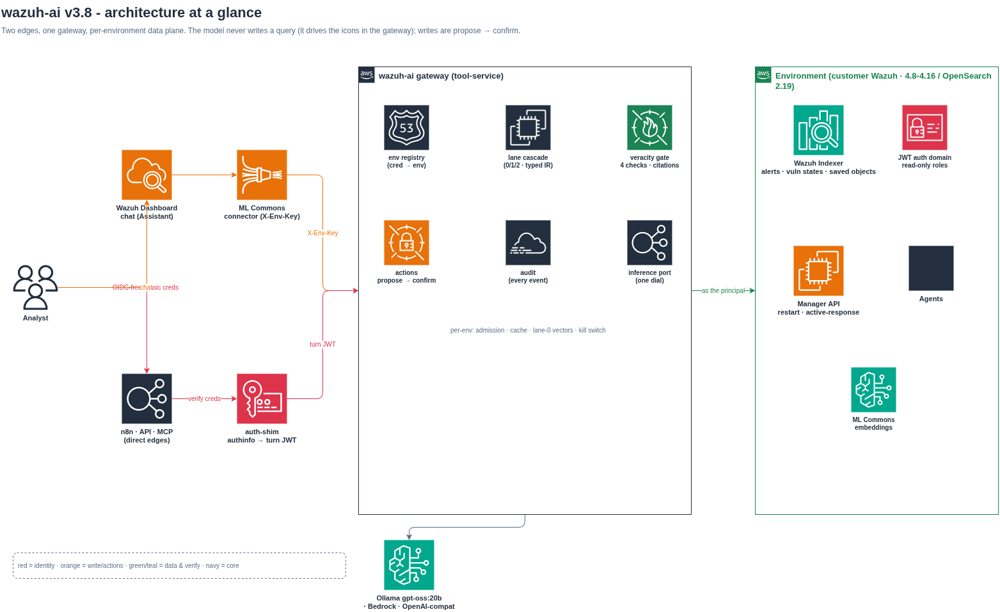
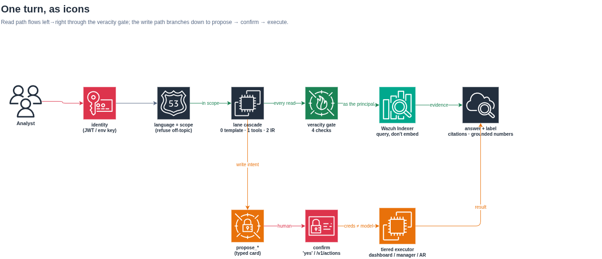
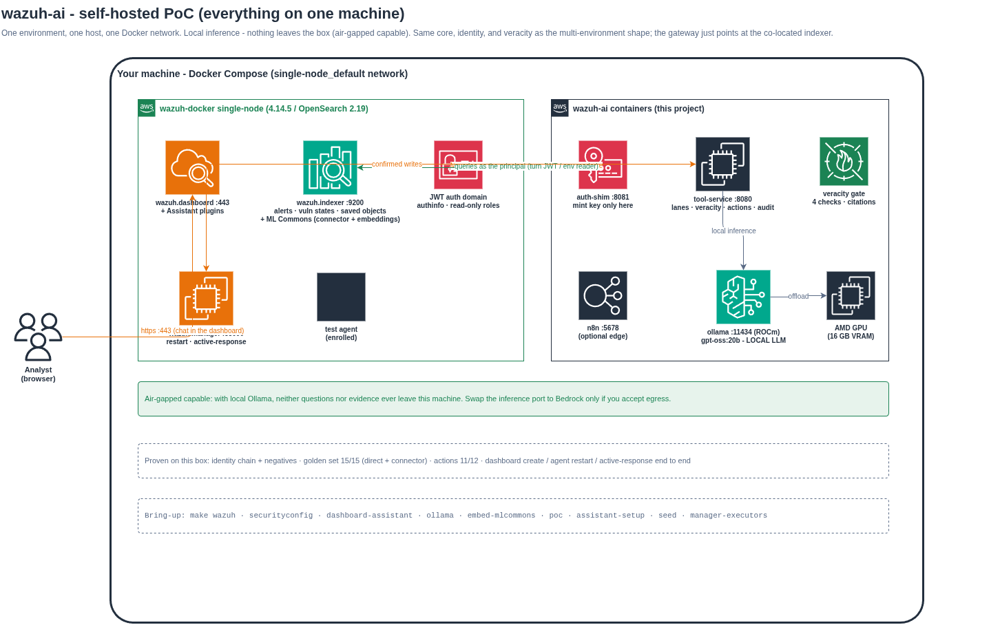

# Wazuh AI Assistant - a self-hosted assistant with verifiable answers

An AI security assistant for Wazuh where **veracity is a property of the architecture, not a prompt**. The model never writes a datastore query and never computes a number: it picks typed tools or emits a typed query plan, the gateway compiles and validates it, executes it *as the asking analyst*, and verifies every citation and number against what was actually retrieved. Write operations (create a dashboard, restart an agent, run active response) are proposed by the model and executed only after a human confirms, under a credential the model never holds. It runs fully self-hosted - the chat lives inside the Wazuh Dashboard and inference can be a local model, so neither questions nor evidence need ever leave the box.

Narrative writeup on the blog: [English](https://resume.leonfuller.com/en/blog/wazuh-ai-assistant-poc/) · [Spanish](https://resume.leonfuller.com/es/blog/asistente-ia-wazuh-poc/). Full design in [`ARCHITECTURE.md`](ARCHITECTURE.md).



## How it works, in one screen

- **Two edges, one gateway.** The chat is the OpenSearch **Dashboards Assistant** inside the Wazuh Dashboard, wired through ML Commons' HTTP connector to our gateway (`tool-service`); n8n, a direct API, and an MCP adapter are additional edges. We adopt the dashboard edge from the [official Wazuh AI_assistant integration](https://github.com/wazuh/integrations/tree/main/integrations/AI_assistant) and replace its query-writing gateway with this veracity core.
- **Read lanes, ranked by verifiability.** Lane 0 answers recurring questions from curated templates with no model in the loop; lane 1 lets the model pick typed tools (alerts, MITRE lookup, environment, vulnerability states); lane 2 lets it emit a typed Query IR compiled to OpenSearch DSL server-side - no scripts, regexp, or wildcards.
- **Every read passes four veracity checks** (mapping validation, dry-run, datastore-computed counts, zero-hit diagnosis), and every answer carries a verifiability label plus verified citations.
- **Identity is real.** Analyst credentials are verified against the environment's *own* indexer (`authinfo`) and exchanged for a short-lived turn JWT; telemetry executes as that analyst through the indexer JWT auth domain, so the assistant can never show more than the user may read. No external IdP.
- **Inference is a port:** a local model via Ollama (default, air-gapped capable), Amazon Bedrock, or any OpenAI-compatible endpoint.



More detail lives in dedicated docs: [`ARCHITECTURE.md`](ARCHITECTURE.md) (the current design + the D-tag decision log) and [`DESIGN-JOURNAL.md`](DESIGN-JOURNAL.md) (how it got here - the phases, decisions, review findings, and the enhancement arc). Diagram sources are in [`diagrams/`](diagrams/), exports in [`diagrams/png/`](diagrams/png/).

## Try it locally (the demo harness)

The repository ships a complete single-machine harness: the official Wazuh single-node stack, the gateway, the auth-shim, a local model, and a deterministic eval set. Prerequisites: Docker + Compose v2, Python 3.10+ (`pip install -r requirements-host.txt`), ~10 GB RAM for Wazuh, and a tool-capable local model (a 16 GB GPU runs `gpt-oss:20b`) or AWS Bedrock access.

```bash
cp .env.example .env         # pick the inference backend; local Ollama is option B
make keys                    # RSA keypair: private to the shim, public to the verifiers
make wazuh                   # clone + start the Wazuh single-node stack (demo only)
make securityconfig          # add the JWT auth domain, roles, and lab users to the indexer
make dashboard-assistant     # bake the Assistant plugins into the dashboard image
make ollama embed-mlcommons  # local model + in-cluster embeddings  (skip for Bedrock)
make poc                     # start the gateway, auth-shim, n8n
make assistant-setup         # register the ML Commons connector, model, and chat agent
make seed                    # ~2000 synthetic alerts with exact ground truths
make evals                   # the bilingual golden set against the live stack
```

Open `https://localhost`, click the **Assistant** icon, and ask "How many alerts in the last 24 hours?". `make evals-actions` and `make evals-connector` exercise the write-actions and dashboard-edge paths; `make test` runs the unit suite. Enabling write actions on an agent also needs `make manager-executors` (least-privilege Wazuh API users). The self-hosted shape this produces:



## Apply it to your own self-hosted Wazuh

The demo harness *creates* a Wazuh to talk to; a real deployment already has one. The assistant is the same - point it at your environment and register the edge. The only structural difference between one environment and many is the registry: each environment is one entry, resolved by its own credential (see the posture comparison in [`diagrams/png/wazuh-ai-selfhosted--self-hosted-vs-cloud-icons.png`](diagrams/png/wazuh-ai-selfhosted--self-hosted-vs-cloud-icons.png)).

Steps, adapting the harness targets to your hosts (all commands read `.env` / `environments.yaml`):

1. **Skip `make wazuh`.** Set `WAI_INDEXER_URL`, the manager and dashboard URLs, and `INDEXER_ADMIN_*` in `.env` to your existing Wazuh (4.8-4.16.x / OpenSearch 2.19.x). Provide the indexer CA and set `indexer_ca_path` rather than disabling TLS verification.
2. **Add the security objects to your indexer** (`make securityconfig`, or apply `securityconfig/` by hand): the `wazuh-ai` JWT auth domain trusting `keys/jwt-public.pem`, the read-only `wazuh_ai_analyst_role` / `wazuh_ai_env_reader_role`, the `wazuh_ai_dashboard_writer` (backend role `kibanauser`) if you enable dashboard actions, and the `wazuh_ai_operator` / `wazuh_ai_responder` mappings for confirmers. Identity itself comes from **your** existing users, LDAP, or SSO - `authinfo` verifies whatever the security plugin already trusts; the lab's internal users are only for the demo.
3. **Register the environment.** Copy `environments.yaml.example` to `environments.yaml` and fill one entry: `env_id`, a strong random `gateway_key`, `indexer_url` + CA, the read-only `reader_basic`, `dashboard_api_url` / `manager_api_url`, the per-tier executor credentials, and the `actions:` tiers you want enabled (deny-by-default; list `manager` / `active_response` only if you want them).
4. **Install the Dashboards Assistant plugins** on your Wazuh dashboard - `assistantDashboards` + `mlCommonsDashboards`, matched to your dashboard's OpenSearch Dashboards version, with `assistant.chat.enabled: true`. `dashboard-assistant/Dockerfile` does exactly this for a containerized dashboard; for a package install, follow the plugin-extraction steps in the upstream [`install_ai_assistant.sh`](https://github.com/wazuh/integrations/tree/main/integrations/AI_assistant).
5. **Wire ML Commons** (`make assistant-setup`, or `scripts/dashboard_assistant_setup.sh`): the cluster settings (trusted connector endpoint = your reachable gateway URL), the remote model + HTTP connector carrying the environment's `X-Env-Key`, the conversational agent, and the `os_chat` root agent. Register the embedding model with `make embed-mlcommons` (or point `WAI_EMBED_*` at any embeddings endpoint).
6. **Choose inference.** Local and air-gapped: `make ollama` (`gpt-oss:20b`). Cloud fidelity: set `WAI_LLM_PROVIDER=bedrock` and the model ids. Either way it is one setting; nothing else changes.
7. **Deploy the gateway + auth-shim** where your indexer can reach the gateway (the ML Commons connector calls *into* it) and the gateway can reach your indexer and manager API. On the demo box that is one Docker network; in production it is normal service networking.
8. **Enable actions (optional):** `make manager-executors` creates least-privilege Wazuh API users (`agent:restart` and `active-response:command`, mutually exclusive), then point the executor credentials in `environments.yaml` at them.

Verify with `make evals-connector` (the dashboard path) and by asking a question in the Assistant chat; the answer's verifiability label confirms the veracity pipeline ran. Everything is driven by `.env` and `environments.yaml` - no code changes to onboard an environment.

## Configuration and layout

Every knob is documented inline in [`.env.example`](.env.example) (inference backend, lane 0, evidence/prompt caching, admission, actions, per-environment overrides). The essentials:

| Knob | Meaning |
|---|---|
| `WAI_LLM_PROVIDER` + `WAI_MODEL_*` | Inference backend and the two model tiers (`bedrock` or any `openai`-compatible endpoint) |
| `WAI_LANE0_ENABLED` / `WAI_EMBED_*` | The no-model semantic fast path and its embeddings endpoint |
| `WAI_ACTIONS_ENABLED` / `WAI_ACTIONS_DIRECT` | Enable write actions (propose→confirm; `direct=false` is the default) |
| `WAI_ENV_*` / `environments.yaml` | Per-environment credential, indexer, executors, and action tiers |
| `WAI_INDEXER_URL` / `WAI_INDEXER_CA_PATH` | Your indexer and its CA |

| Path | What it is |
|---|---|
| `tool-service/` | The gateway: agent loop, Query IR + compiler, four veracity checks, lanes, actions, surfaces |
| `auth-shim/` | The minting sidecar: verifies indexer credentials via `authinfo`, mints turn JWTs |
| `securityconfig/` | Indexer JWT auth domain, roles, and users applied to the live indexer |
| `scripts/` | ML Commons wiring, embeddings, and executor-RBAC setup |
| `dashboard-assistant/` | Dockerfile that bakes the Assistant plugins into the Wazuh dashboard image |
| `golden/`, `seed/` | Deterministic seed data and the bilingual eval gate (`make evals*`) |
| `environments.yaml.example` | The per-environment registry - copy, fill, and you are multi-environment |
| `ARCHITECTURE.md`, `DESIGN-JOURNAL.md` | Current design, and the journey that produced it (incl. the enhancement arc) |
| `diagrams/` | draw.io sources; `diagrams/png/` holds the exported images used above |

Not reproducible on a single box, deferred to a real cloud environment: per-tenant IAM/IRSA, PrivateLink, Bedrock Guardrails content policies, and NetworkPolicy walls. The `kind/` directory holds a two-tenant isolation harness for the multi-environment story.
