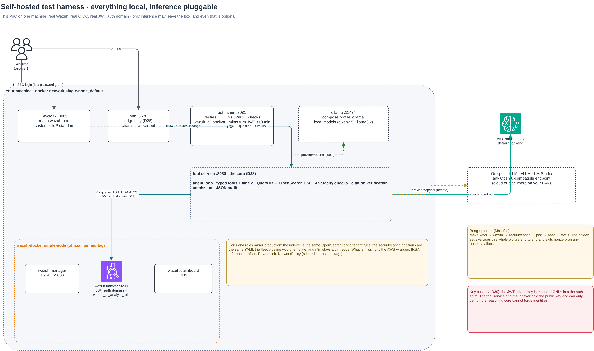
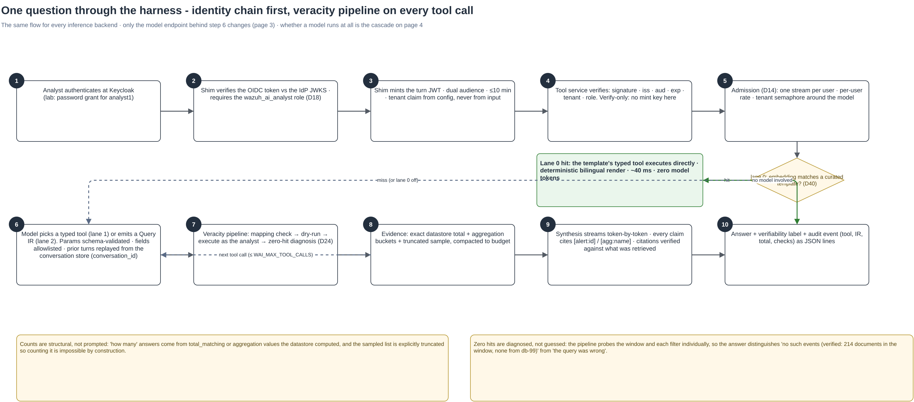
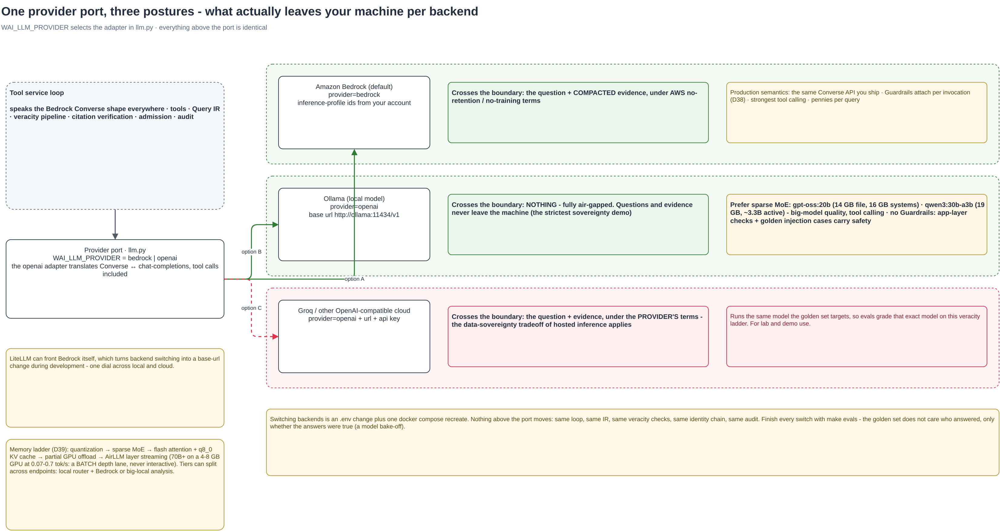
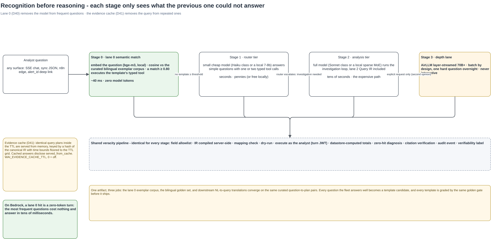
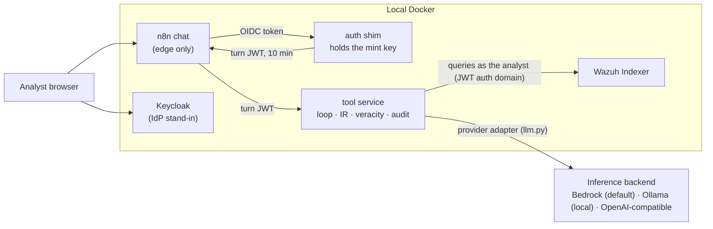
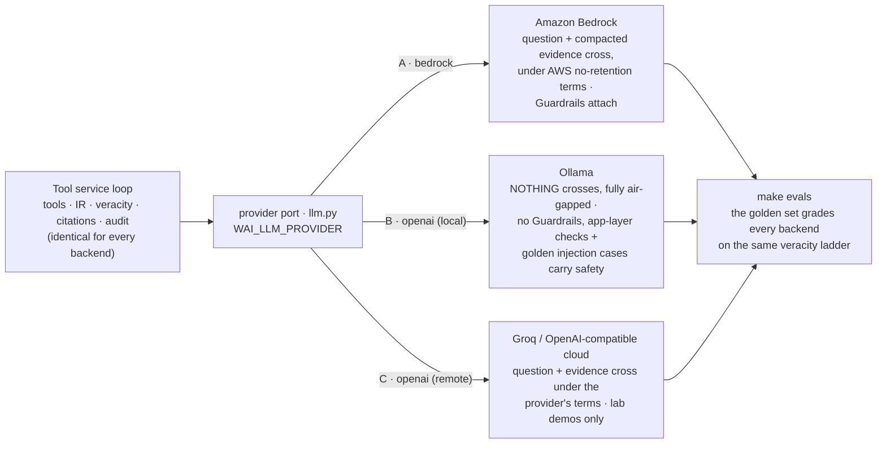
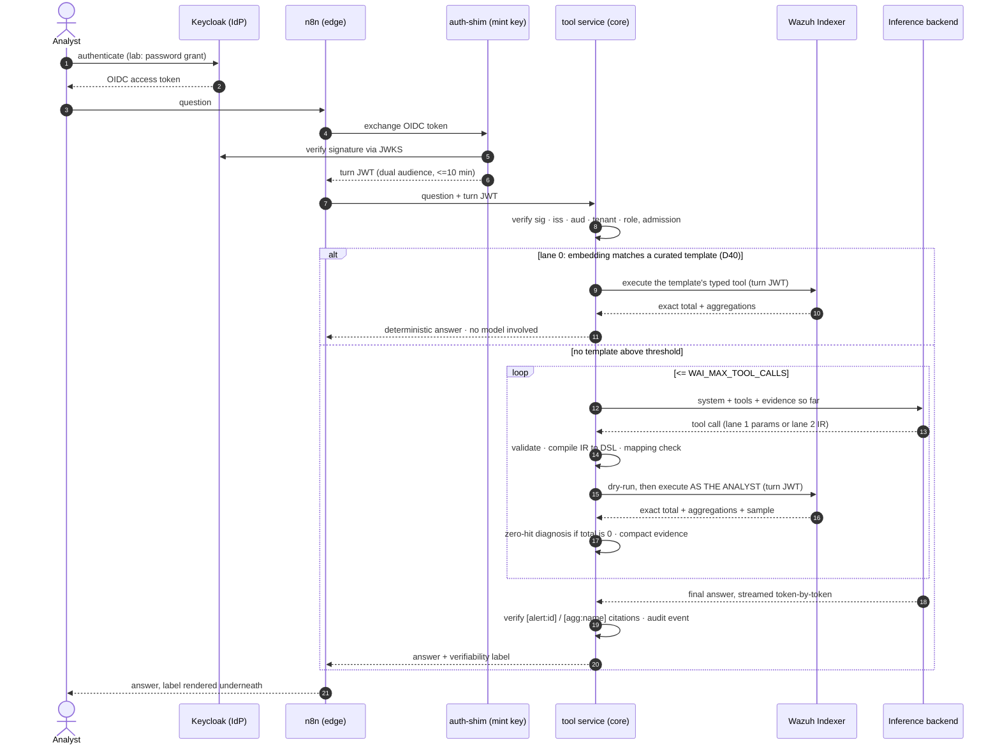

# Wazuh AI Assistant - a self-hosted PoC with verifiable answers

An AI security assistant for Wazuh where veracity is a property of the architecture rather than a hope expressed in a system prompt. The thesis is simple to state. The hard part of an AI assistant for a SIEM is not talking to a model, it is guaranteeing that what the model says about your alerts is true, and every piece of that guarantee can be built and tested on a laptop.

Everything in this directory is runnable configuration and code: a complete local harness (Wazuh single node, Keycloak as the IdP, n8n as the chat edge, an auth shim, and the tool service that owns the agent loop), plus a pluggable inference port covering Amazon Bedrock, fully local models via Ollama, and any OpenAI-compatible endpoint. The narrative writeup lives on my blog in [English](https://resume.leonfuller.com/en/blog/wazuh-ai-assistant-poc/) and [Spanish](https://resume.leonfuller.com/es/blog/asistente-ia-wazuh-poc/).

The design in one paragraph: the model never writes a datastore query and never computes a number. Questions route through lanes ranked by verifiability. Lane 0 answers recurring questions from embedding-matched curated templates with no model in the loop. Lane 1 lets the model pick typed tools with schema-validated parameters. Lane 2 lets it emit a typed Query IR that is allowlist-checked and compiled to OpenSearch DSL server-side. Every query passes four veracity checks (mapping validation, dry-run, datastore-computed counts, zero-hit differential diagnosis), every claim in an answer must carry a citation that is verified against what was actually retrieved, and every answer states its verifiability label. Identity is a chain in which telemetry queries execute as the logged-in analyst through an indexer JWT auth domain, so the assistant can never show anyone more than their own permissions allow.

## Architecture diagrams

The four diagrams below are the whole PoC at a glance, exported from an editable draw.io source at [`diagrams/wazuh-ai-poc-architecture.drawio`](diagrams/wazuh-ai-poc-architecture.drawio). The D-tags in the labels are defined in [section 9](#9-design-decision-tags).

**1. What runs where** - the self-hosted stack on one machine and the pluggable inference port ([section 1](#1-what-runs-where)).



**2. One question, end to end** - the identity chain first, then the veracity pipeline on every tool call, with the lane 0 fast-path branch ([sections 4-5](#4-the-identity-chain-end-to-end)).



**3. Inference backends and sovereignty** - one provider port, three postures, and exactly what crosses your machine boundary per backend ([section 3](#3-choosing-the-inference-backend)).



**4. Query cascade** - recognition before reasoning: lane 0 semantic match, the router and analysis tiers, the batch depth lane, and the evidence cache ([sections 3.5-3.6](#35-lane-0-and-the-evidence-cache-whether-a-model-runs-at-all)).



## 1. What runs where

Everything except inference is local, and even inference can be. The Wazuh stack is the official single-node Docker deployment, so the indexer the assistant queries is the same OpenSearch fork a production deployment runs. Keycloak stands in for the identity provider. n8n is the chat edge. The auth shim and the tool service are the two components this project actually builds. The inference backend is a pluggable port behind `llm.py`: the default is Amazon Bedrock, because testing against the same inference API you would ship is worth more than a weaker offline substitute, but the same harness runs fully air-gapped on a local model through Ollama, or against Groq and any other endpoint that speaks the OpenAI chat-completions dialect. Section 3 walks the setup for each, and nothing above that one module changes when you switch.



| Component | What it exercises | Faithful to production? |
|---|---|---|
| Wazuh single node (manager, indexer, dashboard) | The datastore and its security plugin | Yes, same software |
| Indexer JWT auth domain plus `wazuh_ai_analyst_role` | Queries-as-user (D11) | Yes, real securityconfig |
| Keycloak realm `wazuh-poc` | The identity provider in the SSO-fronted mode (D30) | Yes, real OIDC |
| auth-shim | The minting sidecar (D30) | Yes, same code shape |
| tool-service | Loop, IR, compiler, four veracity checks, citation verification, admission, audit (D28/D29/D32) | Yes, same code shape |
| n8n | The thin edge (D28) | Yes |
| Inference backend (Bedrock default, Ollama profile, OpenAI-compatible) | Two-tier models (D37), and on Bedrock the guardrail attachment point (D38) | Bedrock yes, minus IAM specifics. Local models approximate the reasoning, not the production semantics |
| Not reproducible locally | IRSA, per-tenant KMS, PrivateLink, Bedrock Guardrails content policies | These belong to a real AWS environment |

## 2. Bring-up

Prerequisites are Docker with Compose v2, Python 3.10 or newer on the host with `pip install -r requirements-host.txt`, and roughly 10 GB of RAM headroom for the Wazuh stack. The default inference backend additionally needs AWS credentials with Bedrock model access in one region, and section 3 covers the fully local alternative that needs no cloud account at all.

```bash
cp .env.example .env    # set AWS_REGION and the two Bedrock model ids
make keys               # RSA keypair: private to the shim, public to the verifiers
make wazuh              # clone wazuh-docker at the pinned tag, generate certs, start
make securityconfig     # add the JWT auth domain + analyst role to the live indexer
make poc                # build and start keycloak, n8n, auth-shim, tool-service
make seed               # ~2000 synthetic alerts with exact ground truths
make evals              # the bilingual golden set against the live stack
make test               # unit suite: IR, compiler, lane 0 slots, cache keys
```

Two values in `.env` deserve attention before anything else. `WAI_MODEL_ROUTER` and `WAI_MODEL_ANALYSIS` are placeholders for the two model tiers, and on the default Bedrock backend the correct identifiers for your account and region come from `aws bedrock list-inference-profiles`, surfaced early because a wrong model id is the most common first-run failure. And before `make poc`, decide which inference backend the run uses. The next section covers the options, and the default configuration in `.env.example` is Bedrock.

## 3. Choosing the inference backend

Inference is a port, not a dependency. `WAI_LLM_PROVIDER` selects the adapter inside `tool-service/app/llm.py`, both adapters speak the same Converse-shaped interface to the loop, and everything this harness actually tests (the identity chain, the IR, the four veracity checks, citation verification, admission, audit) is identical no matter which backend answers. What changes between backends is fidelity, cost, hardware, and the sovereignty story you can honestly tell. The picture below shows exactly what crosses the machine boundary in each case.



| Backend | Setting | What you gain | What you accept |
|---|---|---|---|
| Amazon Bedrock (default) | `WAI_LLM_PROVIDER=bedrock` | Production semantics: the Converse API, guardrail attachment, strong tool calling | Not air-gapped, pennies per query, needs AWS credentials with model access |
| Ollama (local model) | `WAI_LLM_PROVIDER=openai` + the ollama profile | Fully offline and free. The strictest sovereignty demo: questions and evidence never leave the machine | Tool-call quality depends on the model and your hardware, and Bedrock Guardrails do not exist here |
| Groq | `WAI_LLM_PROVIDER=openai` + Groq url and key | Fast and cheap, and a way to grade a hosted open-weights model on the same ladder | Evidence transits Groq under its terms |
| LiteLLM, vLLM, LM Studio, others | `WAI_LLM_PROVIDER=openai` + their url | One adapter covers every OpenAI-compatible server, including LiteLLM proxying Bedrock itself | The caveats of whatever model sits behind it |
| AirLLM depth lane (experimental) | the `airllm` compose profile + a split analysis tier (D39) | Frontier-size models (70B and beyond) on a 4 to 8 GB GPU via layer streaming, still air-gapped | Batch latency by design: 0.07 to 0.7 tokens per second measured upstream, and the tool convention is experimental (section 3.4) |

### 3.1 Amazon Bedrock (default, highest fidelity)

Nothing beyond the quickstart is needed. Export your AWS credentials (or rely on an already-configured environment), confirm Bedrock model access is enabled in your region, and resolve the two placeholder ids:

```bash
aws bedrock list-inference-profiles --region "$AWS_REGION" \
  --query "inferenceProfileSummaries[].inferenceProfileId"
```

Set `WAI_MODEL_ROUTER` to the Haiku-class id and `WAI_MODEL_ANALYSIS` to the Sonnet or Opus class id, then `make poc`. If you have created a Bedrock Guardrail, put its id in `WAI_GUARDRAIL_ID` and every invocation carries it (D38).

### 3.2 Local model with Ollama (fully offline)

This is the air-gapped variant. The compose file ships an optional `ollama` service behind a Docker profile, so it costs nothing unless you ask for it:

```bash
make ollama                        # starts the service and pulls qwen2.5:14b
make ollama OLLAMA_MODEL=llama3.1:8b   # or pick another tool-capable model
```

Then switch the provider in `.env` (option B in `.env.example`) and recreate the service:

```bash
WAI_LLM_PROVIDER=openai
WAI_LLM_BASE_URL=http://ollama:11434/v1
WAI_MODEL_ROUTER=qwen2.5:14b
WAI_MODEL_ANALYSIS=qwen2.5:14b
```

```bash
docker compose -f docker-compose.poc.yml up -d --force-recreate tool-service
make evals
```

Three honest caveats. First, hardware sets the floor, and the best answer to a low floor is a sparse MoE model rather than a smaller dense one: `gpt-oss:20b` (21B parameters, about 3.6B active, a 14 GB file that runs on 16 GB systems) and `qwen3:30b-a3b` (30.5B parameters, about 3.3B active, 19 GB quantized) both support tool calling and deliver big-model quality at small-model compute, which section 3.4 covers in depth. A dense 8b-class model is lighter still but calls tools unreliably, and dense 70b wants a workstation. Second, the model must actually support tool calling, which `ollama show <model>` reports under capabilities. Third, Bedrock Guardrails do not exist here, so the app-layer validation and the golden set's injection cases carry the safety story alone, and the service logs a `guardrail_ignored` audit event if you leave a guardrail id configured to make that visible.

The golden set turns this from a compromise into an instrument. Run `make evals` per candidate model and the pass rate is your model bake-off: a model that miscounts, invents citations, or fumbles the zero-hit diagnosis fails cases by construction, and you learn it in two minutes instead of in a demo. There is also a narrative payoff. With Ollama the entire loop is air-gapped, so the strongest sovereignty sentence, that neither questions nor evidence ever leave the machine, becomes literally true (D26).

### 3.3 Groq and other OpenAI-compatible endpoints

Create a key at console.groq.com and set option C in `.env`:

```bash
WAI_LLM_PROVIDER=openai
WAI_LLM_BASE_URL=https://api.groq.com/openai/v1
WAI_LLM_API_KEY=gsk_your_key_here
WAI_MODEL_ROUTER=llama-3.3-70b-versatile
WAI_MODEL_ANALYSIS=llama-3.3-70b-versatile
```

Recreate the tool service as above and the same nine golden cases now grade that model on your veracity ladder. State the sovereignty position plainly when you use it: evidence transits Groq under Groq's terms, acceptable for a lab and never for anything customer-facing.

The same provider setting covers every other OpenAI-compatible server. Point `WAI_LLM_BASE_URL` at a LiteLLM proxy, a vLLM deployment, or LM Studio and it works unchanged. LiteLLM deserves a special mention because it can front Bedrock itself, which turns backend switching into a base-url change and is a reasonable pattern if you want one dial across local and cloud during development (section 3.6).

Whatever backend you choose, finish the switch the same way: `make evals`. The gate does not care who answered, only whether the answers were true.

### 3.4 Memory-optimized local serving: the ladder, split tiers, and the AirLLM depth lane

Running a capable model on modest hardware is not one technique, it is a ladder, and the harness expresses every rung through configuration rather than code changes. The findings below were verified against upstream sources in July 2026 (the [AirLLM repository](https://github.com/lyogavin/airllm), the [Ollama FAQ](https://docs.ollama.com/faq) and model library, and the llama.cpp server documentation), because this is an area where folklore outruns facts.

**Rung one is quantization**, and Ollama already stands on it: the default `Q4_K_M` tags cost roughly 0.6 GB of memory per billion parameters for the weights, which is why a 14b model fits in about 10 GB. **Rung two is the one most people miss: sparse mixture-of-experts models.** A MoE model stores many parameters but activates only a few per token, so it reads like a big model and computes like a small one, which is exactly the profile CPU and small-GPU serving wants. Two concrete, tool-capable options from the Ollama library: `gpt-oss:20b` (21B total, about 3.6B active, a 14 GB MXFP4 file that Ollama states runs on 16 GB systems) and `qwen3:30b-a3b` (30.5B total, about 3.3B active, 19 GB quantized, comfortable on a 32 GB machine or a 24 GB GPU). For this harness they are the recommended analysis-tier upgrades over dense 14b models, and `make ollama OLLAMA_MODEL=gpt-oss:20b` is the one-line switch.

**Rung three is runtime tuning**, which the compose file ships by default on the `ollama` service: `OLLAMA_FLASH_ATTENTION=1` enables the quantized key-value cache, `OLLAMA_KV_CACHE_TYPE=q8_0` roughly halves the memory the context window consumes at negligible quality cost (`q4_0` quarters it, with more risk), `OLLAMA_MAX_LOADED_MODELS=2` keeps both tiers resident so routing never evicts analysis, and `OLLAMA_KEEP_ALIVE=30m` stops the model reloading between golden-set cases. Partial GPU offload is the same rung: Ollama and llama.cpp place as many layers as fit in VRAM and run the rest on CPU, so an 8 GB card accelerates a model it cannot hold.

**Rung four is the tier split (D39).** The router and analysis tiers can bind to different providers and endpoints, configured with the `WAI_ROUTER_*` and `WAI_ANALYSIS_*` overrides (option D in `.env.example`). Two splits earn their keep. Local router plus Bedrock analysis keeps the frequent cheap decisions free and offline while the hard reasoning stays on the production-fidelity backend, which is a cost optimization even outside the lab. And resident-small plus bigger-slower-local keeps everything air-gapped while sizing each tier to what the hardware actually serves interactively.

**Rung five is layer streaming, the AirLLM-class extreme**, and it deserves a precise description because the promise is real and so is the price. AirLLM keeps exactly one transformer layer on the GPU at a time and streams the rest from disk, so the VRAM requirement follows the largest layer rather than the model: a 70B-class model runs on a 4 GB GPU. The price is that inference becomes disk-bound: measured throughput is about 0.7 tokens per second in the best NVMe-plus-GPU case and as low as 0.07 on laptop hardware, which means a 500-token answer takes ten minutes and a full tool-calling turn can take hours. That is not an interactive assistant, and no configuration makes it one. It is a **batch depth lane**: the place to send one hard question overnight, to produce a maximum-quality second opinion on evidence already gathered, or to benchmark how much answer quality improves with model size before paying for bigger hardware.

The harness wires that lane honestly. AirLLM ships no server, no chat templating and no tool calling, so `airllm-shim/` wraps it in the same OpenAI-compatible dialect the port already speaks: chat templates come from the model's own tokenizer, and tools ride a prompt-rendered convention where schemas are injected into the system prompt and a fenced `tool_call` JSON block in the output is parsed back into a standard tool-calls response. Large models usually follow the convention, smaller ones often do not, and the shim is marked experimental for exactly that reason. Bring it up with `make airllm`, bind the analysis tier to it with option D2, and raise the client timeout expectations accordingly. For completeness, the alternatives in this space were surveyed and rejected: FlexGen is unmaintained, DeepSpeed ZeRO-Inference is batch scripts without a server, and PowerInfer has pivoted toward its own hardware, so AirLLM behind a thin shim is the honest representative of the class.

Reading the ladder as hardware guidance: a CPU-only 16 GB machine serves `qwen3:8b` comfortably and `gpt-oss:20b` marginally, a 32 GB machine serves the MoE pair well, an 8 GB GPU serves dense 7-8b fully offloaded or a MoE with partial offload, a 24 GB GPU holds `qwen3:30b-a3b` entirely, and every one of those configurations can additionally reach a 70B-class model through the depth lane if a question is worth waiting for. The loop, the IR, the veracity checks, the identity chain and the audit are identical on every rung, which is the whole point of keeping inference behind one port.

### 3.5 Lane 0 and the evidence cache: whether a model runs at all

The ladder optimizes where a model runs. The next two features optimize whether one runs at all, and both ship off by default behind flags.

**Lane 0 (D40) is recognition before reasoning.** A large share of SOC questions are recognitions, not reasoning: "top 5 noisiest agents" has one right query, and matching the question to it needs an embedding model (milliseconds, on CPU), not a reasoning model (seconds and tokens). Lane 0 embeds the incoming question with a small local model (`bge-m3`, which handles English and Spanish in one vector space), matches it by cosine similarity against a curated bilingual corpus of utterance-to-template pairs in `tool-service/app/lane0.py`, extracts parameter slots (time window, top-N, agent, rule, severity) with deterministic bilingual rules, and executes the matched typed template through the exact same veracity pipeline as every other lane. The answer is rendered by code from datastore-computed results and labeled "no model involved", which makes lane 0 the most verifiable lane, not a shortcut. A match below the 0.80 threshold, or a template whose required slots cannot be filled, escalates silently to the normal model loop, so lane 0 can never break the assistant, only relieve it. Enable it with:

```bash
make embed                # pulls bge-m3 onto the ollama service
# then in .env: WAI_LANE0_ENABLED=true (option E)
```

On Bedrock, a lane 0 hit is a zero-token turn: the most frequent questions cost nothing and answer in tens of milliseconds.

**The evidence cache (D41)** sits beside it: identical query plans within a TTL are served from memory, keyed by a hash of the canonical IR with time bounds floored to the TTL grid, so "last 24 hours" asked twice in the same minute is one query rather than two. Cached answers disclose `served_from_cache`, because an assistant built on verifiability does not get to hide its shortcuts. `WAI_EVIDENCE_CACHE_TTL` in seconds, 0 disables.

### 3.6 Load balancing and failover with LiteLLM

The `litellm` compose profile starts a LiteLLM proxy configured by `litellm/config.yaml`: model groups with least-busy routing across replicas, and fallback groups that fail from a local endpoint over to Bedrock. Point a provider (or one tier via option D) at `http://litellm:4000/v1` and the proxy becomes one dial across local and cloud. One honesty note belongs here. A fallback group means the answering model can differ from the requested one, which is exactly the silent-downgrade behavior the admission design forbids (D14). In a lab it is acceptable because the audit stream and LiteLLM's logs record the substitution, but anything customer-facing that adopts a proxy must surface the served model in the answer's label, the same way lane 0 discloses its template.

## 4. The identity chain, end to end

The property being demonstrated is that the reasoning core can never forge an identity and holds no standing credential that reads telemetry. The chain has four hops and each one verifies the previous one. The sequence below is the whole turn in one picture, identity first and then the loop.



The analyst first authenticates against Keycloak. In the lab that is a password grant for the test user `analyst1`, who carries the realm role `wazuh_ai_analyst`, the opt-in gate (D18):

```bash
OIDC=$(curl -s http://localhost:8085/realms/wazuh-poc/protocol/openid-connect/token \
  -d grant_type=password -d client_id=wazuh-ai \
  -d username=analyst1 -d password=analyst1 | jq -r .access_token)
```

The shim then verifies that token against the Keycloak JWKS, checks the role, and mints the turn credential. The minted token lives at most ten minutes, carries both audiences, and its `tenant` claim comes from deployment configuration rather than from anything in the request:

```bash
TURN=$(curl -s -X POST http://localhost:8081/v1/token/exchange \
  -H "Authorization: Bearer $OIDC" | jq -r .access_token)
```

The tool service verifies the turn token with the public key only. Try the negative cases and watch them fail closed: a token signed by any other key is rejected at signature verification, a token for another tenant is rejected by the tenant-claim check and audited as `cross_tenant_token_rejected`, and the user `viewer1`, who exists in the realm but lacks the analyst role, is refused by the shim before a turn token ever exists.

The fourth hop is the one that makes queries-as-user real (D11). The indexer's securityconfig now contains a JWT auth domain trusting the same public key, so the tool service forwards the analyst's own token and the indexer resolves `backend_roles` to the read-only `wazuh_ai_analyst_role`. You can prove the ceiling directly, with no AI involved:

```bash
# allowed: read alerts as the analyst
curl -sk -H "Authorization: Bearer $TURN" \
  "https://localhost:9200/wazuh-alerts-*/_count" | jq
# denied: the analyst role cannot write, delete, or read other indices
curl -sk -X DELETE -H "Authorization: Bearer $TURN" \
  "https://localhost:9200/wazuh-alerts-4.x-2026.07.08"
```

The assistant can never show a user more than that token can query, because the assistant queries with that token.

## 5. The veracity ladder, live

Seeding writes about two thousand synthetic alerts with a deterministic seed and records the exact ground truths (total volume, authentication failures in the last day, the most frequent rule, one known alert id) into `golden/ground_truth.json`. That file is what turns demos into assertions.

A full turn goes through the SSE surface or, more conveniently for the terminal, the synchronous one:

```bash
curl -s -X POST http://localhost:8080/v1/chat/sync \
  -H "Authorization: Bearer $TURN" -H "Content-Type: application/json" \
  -d '{"text": "How many authentication failures in the last 24 hours, and which users are targeted?"}' | jq
```

The response carries the answer plus the fields that make it checkable: `tools_called`, the `checks` that ran, `usage`, any citation `corrections`, and the `verifiability` label derived from the lane and checks. The count in the answer is trustworthy for a structural reason rather than a prompt reason. The `count_alerts` and `auth_failures` tools return the datastore's `total_matching` and aggregation buckets, the sampled alert list is explicitly truncated, and the system prompt receives numbers only as fields it must cite. The model never gets an unaggregated list where a count question is in play.

Three scenarios show the four checks doing their jobs. Ask about an agent that does not exist, `Show me alerts from agent db-99 today`, and the zero-hit differential diagnosis probes the window and each filter individually, so the answer distinguishes "the window has 214 documents and none are from db-99" from "the query was wrong". Ask something the catalog cannot express and lane 2 engages: the model composes a `run_query_ir` plan, which is schema-validated against the field allowlist, checked against the live index mapping, dry-run by the datastore, and only then executed, with the label switching to "constrained query plan, verified by validation". And every claim in every answer must cite `[alert:<id>]` or `[agg:<name>]` identifiers that the service checks against what was actually retrieved, so an invented citation surfaces as a correction event rather than a confident lie.

The golden runner wires all of this into a gate. It authenticates through the full chain, runs nine bilingual cases against the live stack, asserts tool selection, ground-truth counts, zero-hit honesty, injection resistance, and the absence of unverified citations, and exits nonzero on any failure. Point CI at `make evals` and prompt changes become physically unable to merge unevaluated (D33).

## 6. The three surfaces

The same hardened internals answer through three doors, which is the headless-core argument (D21) made concrete. `POST /v1/chat` is the SSE product API with keepalives and token streaming. `POST /v1/chat/sync` is the same turn as one JSON document, which is what the n8n workflow consumes. And `POST /v1/tools/{name}` executes exactly one validated tool with no model involved, returning the evidence JSON: the same HTTP shape a raw community-node workflow expects, but behind it sit the allowlist, the IR, the dry-run, the datastore-computed totals, and the audit event. The n8n build steps in [`n8n/README.md`](n8n/README.md) produce a chat that displays the verifiability label under every answer.

Everything the service does is also observable. `make logs` tails structured JSON audit events, one per rejected token, per executed tool with its full IR, and per completed turn with usage and label. `GET /metrics` exposes Prometheus counters and histograms alongside them: turns by lane, tool calls by outcome, lane 0 hits and escalations, token usage by direction, and turn latency.

## 7. What this harness proves and what it defers

Proven locally: the full loop from question to verified answer, the four veracity checks against a real OpenSearch, queries-as-user through a real JWT auth domain, the OIDC-to-turn-credential exchange with the mint key isolated in the shim, honest admission rejections, structured audit, the typed catalog and lane 2 through one IR, bilingual evaluation as an executable gate, and the n8n edge consuming both the chat and tool surfaces.

Deferred to a real cloud environment, deliberately: IRSA and per-tenant IAM, application inference profiles and cost attribution, Bedrock Guardrails content policies, PrivateLink, and NetworkPolicy walls, which need a real Kubernetes rather than Compose. The natural second stage of this harness is moving the same containers into a kind cluster with two tenant namespaces to run a cross-tenant isolation suite.

Operational features that started as simplifications and are now closed with code: answers stream token-by-token from both providers (`WAI_STREAMING`), turns carry a conversation window keyed by `conversation_id` (`WAI_CONVERSATION_TTL`), model capacity is a bounded queue that rejects honestly after `WAI_QUEUE_WAIT_S` seconds instead of stalling, `WAI_SERVICE_ENABLED=false` is a kill switch that turns every surface into a 503, the indexer client pins the root CA when `WAI_INDEXER_CA_PATH` is set, and Bedrock prompt caching sits behind `WAI_PROMPT_CACHE` (verify how cached tokens are billed before trusting the usage numbers). What remains simplified, named so nobody mistakes it for design: the conversation store is process memory rather than a persistent index (`app/state.py` is the documented seam), streamed answers from some OpenAI-compatible backends report zero token usage because their streams carry no usage frame, and the unit suite (`make test`, 26 cases) covers the deterministic core of IR validation, DSL compilation, lane 0 slot extraction, cache keying and evidence compaction, while the loop itself is covered live by the golden set.

## 8. Configuration reference

| Knob | Default | Meaning |
|---|---|---|
| `WAZUH_VERSION` | 4.14.5 | wazuh-docker tag to clone |
| `WAI_LLM_PROVIDER` | bedrock | Inference adapter: `bedrock` or `openai` (any OpenAI-compatible endpoint, section 3) |
| `WAI_LLM_BASE_URL` | http://ollama:11434/v1 | Chat-completions base url for the `openai` provider |
| `WAI_LLM_API_KEY` | empty | Bearer key when the endpoint requires one (Groq, LiteLLM) |
| `WAI_MODEL_ROUTER` / `WAI_MODEL_ANALYSIS` | placeholders | The two model tiers (D37). Bedrock profile ids, or the endpoint's model names on `openai` |
| `WAI_ROUTER_*` / `WAI_ANALYSIS_*` (provider, base url, api key) | empty | Per-tier overrides (D39, section 3.4). Empty inherits the `WAI_LLM_*` globals |
| `AIRLLM_MODEL_ID` / `AIRLLM_COMPRESSION` | Qwen2.5-7B-Instruct / 4bit | The depth-lane shim's HuggingFace model and layer compression (`make airllm`) |
| `OLLAMA_MODEL` (make variable) | qwen2.5:14b | Model pulled by `make ollama` (MoE upgrades: `gpt-oss:20b`, `qwen3:30b-a3b`) |
| `WAI_GUARDRAIL_ID` | empty | Attach a Bedrock Guardrail to every invocation when set (`bedrock` provider only) |
| `WAI_LANE2_ENABLED` | true | Expose `run_query_ir`, the constrained builder |
| `WAI_MAX_TOOL_CALLS` | 6 | Loop cap per turn |
| `WAI_EVIDENCE_BUDGET_CHARS` | 24000 | Evidence compaction budget per tool result |
| `WAI_LANE0_ENABLED` / `WAI_LANE0_THRESHOLD` | false / 0.80 | Semantic fast path (D40, section 3.5): embedding-matched questions run curated templates with no model |
| `WAI_EMBED_BASE_URL` / `WAI_EMBED_MODEL` | ollama / bge-m3 | Embedding endpoint for lane 0 (`make embed` pulls the model) |
| `WAI_EVIDENCE_CACHE_TTL` | 0 (off) | IR-keyed evidence cache in seconds (D41), cached answers disclose `served_from_cache` |
| `WAI_STREAMING` | true | Token-by-token SSE from both providers, `false` falls back to one-shot answers |
| `WAI_QUEUE_WAIT_S` | 30 | Seconds a turn queues for model capacity before an honest busy rejection (D14) |
| `WAI_SERVICE_ENABLED` | true | Kill switch: `false` returns 503 on every surface |
| `WAI_CONVERSATION_TTL` | 3600 | Lifetime of the in-memory multi-turn window per `conversation_id` |
| `WAI_INDEXER_CA_PATH` | empty | Pin the wazuh root CA for indexer TLS (see the commented mount in the compose file) |
| `WAI_PROMPT_CACHE` | false | Bedrock `cachePoint` on the system prelude (verify how cached tokens are billed) |
| `WAI_JWT_TTL_SECONDS` | 600 | Turn credential lifetime, at most one turn |

The generated directories follow one rule: `.wazuh-docker/` and `keys/` are outputs, edit the scripts and the `.env` instead.

## 9. Design decision tags

Comments across the code carry `D<n>` tags referring to the design log this PoC was built from. The ones that appear here, in one line each:

| Tag | Decision |
|---|---|
| D3 / D38 | Guardrails attach per invocation, with per-deployment profiles |
| D4 | The model never writes datastore queries. Typed tools, compiled server-side |
| D6 | The tenant claim comes from deployment configuration, never from input |
| D7 | Conversation and audit state belong in the deployment's own indexer |
| D8 | Application-level audit events, one per token rejection, tool call, and turn |
| D11 | Telemetry queries execute as the logged-in analyst via an indexer JWT auth domain |
| D12 | Bilingual (English and Spanish) by construction, corpus and golden set included |
| D14 | Admission control with honest rejection. No silent downgrades or spillover |
| D18 | Access is gated by an opt-in analyst role |
| D21 | Headless core with three surfaces: SSE chat, sync JSON, per-tool HTTP |
| D22 / D29 | A typed Query IR with per-datastore compilers, OpenSearch DSL first |
| D23 | Every answer carries a verifiability label derived from its lane and checks |
| D24 | The four veracity checks: mapping validation, dry-run, computed counts, zero-hit diagnosis |
| D26 | Two synthesis modes: local-render (code writes the answer) and cloud-synthesis |
| D28 | n8n is edge only. The tool service owns the agent loop |
| D30 | Identity minting lives in a dedicated sidecar. The core verifies, never mints |
| D32 | Lanes 1 and 2 ship with all four checks. Lane 3 (free generation) stays off |
| D33 | The bilingual golden set is a CI gate from day one |
| D34 | Explain-this-alert enters through a deep link (`alert_id`) |
| D37 | Two model tiers: a cheap router and a stronger analysis model |
| D39 | Each tier can bind to its own provider and endpoint |
| D40 | Lane 0: embedding-matched curated templates answer with no model in the loop |
| D41 | The evidence cache, keyed on the canonical IR, always disclosed |

## 10. Layout

| Path | What it is |
|---|---|
| `docker-compose.poc.yml` | Overlay compose: keycloak, n8n, auth-shim, tool-service on the Wazuh network |
| `tool-service/` | The core: agent loop, Query IR, OpenSearch compiler, 4 veracity checks, SSE + HTTP tool surfaces |
| `tool-service/tests/` | 26-case unit suite for the deterministic core (`make test`) |
| `auth-shim/` | The minting sidecar: verifies Keycloak OIDC tokens, mints turn JWTs (D30) |
| `keycloak/` | Realm export: test realm, client, analyst user and role |
| `securityconfig/` | Indexer JWT auth domain + role fragments and the apply script |
| `seed/` | Synthetic alert generator with deterministic ground truths |
| `golden/` | Bilingual golden set and the eval runner (the CI gate, D33) |
| `n8n/` | Instructions for the chat workflow that consumes the tool service |
| `airllm-shim/` | EXPERIMENTAL batch depth lane: AirLLM layer streaming behind an OpenAI-compatible shim (section 3.4) |
| `litellm/` | Load-balancing / failover proxy config (compose profile `litellm`, section 3.6) |
| `diagrams/` | draw.io source (`wazuh-ai-poc-architecture.drawio`) and PNG exports of the four architecture diagrams |
| `keys/` | Generated JWT keypair (gitignored) |

`.wazuh-docker/` and `keys/` are generated, edit the scripts instead.
