# Diagrams

Editable `.drawio` sources live here; PNG exports are in [`png/`](png/) (regenerate with `make diagrams-png`). The current architecture is the v3 set; the rest are kept for lineage.

## Current architecture (v3.8)

### `wazuh-ai-v3-icons.drawio` - icon-forward overview
The whole system at a glance and one turn end to end, glyph-driven.

### `wazuh-ai-v3-gateway.drawio` - topology, labelled
The target multi-environment shape (one gateway, N environments) and its single-environment realization on the harness.

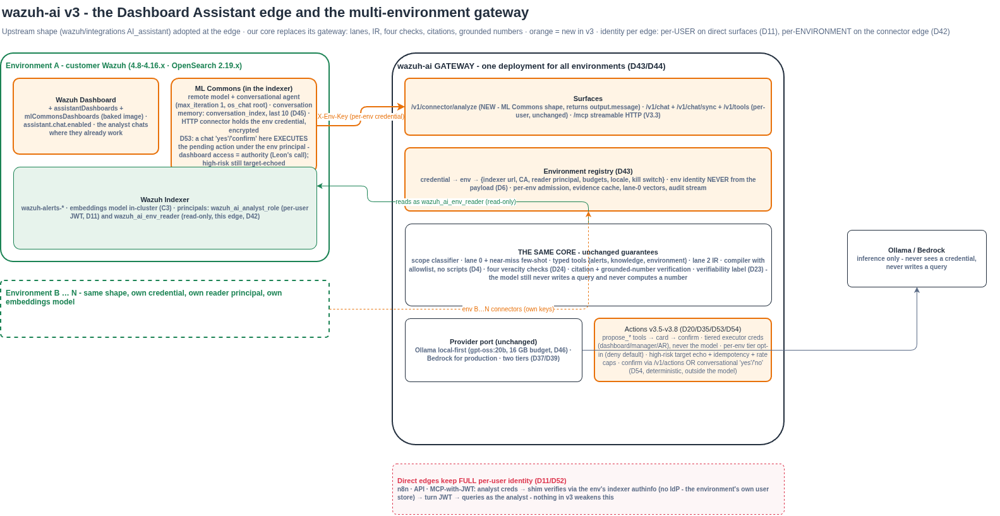
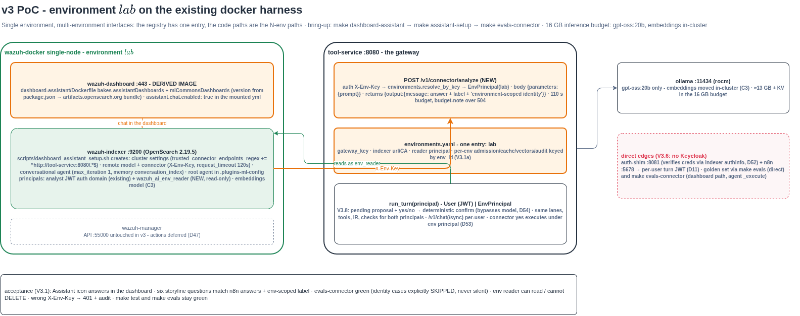

### `wazuh-ai-v3-workflow.drawio` - one turn, labelled
The full turn with every branch: both edges, admission, conversational/API confirm, language and scope, the read lane cascade, the write-actions lane, the veracity pipeline, and answer assembly.

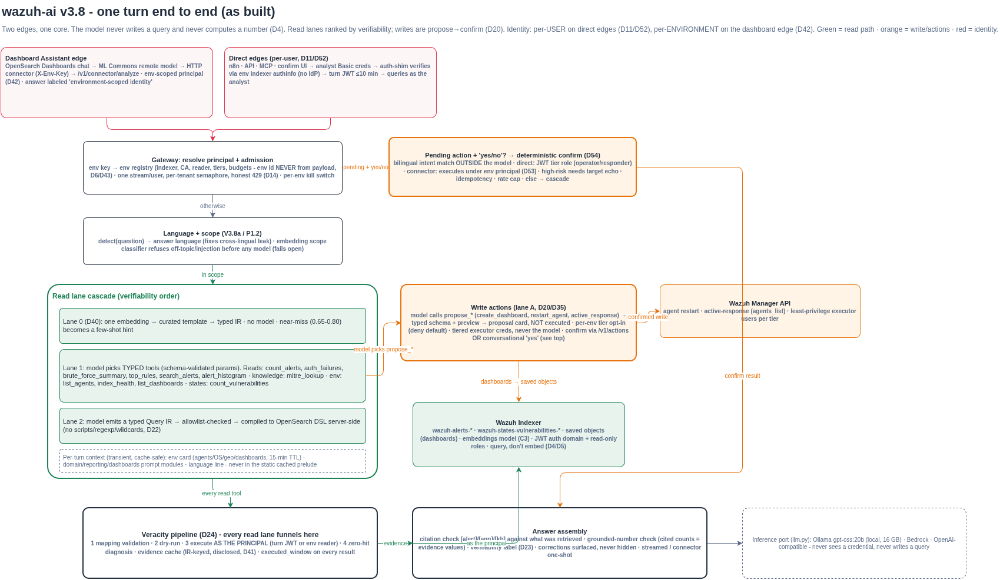

### `wazuh-ai-selfhosted.drawio` - self-hosted deployment
The PoC as it runs on one machine, and how the same codebase scales to many environments.

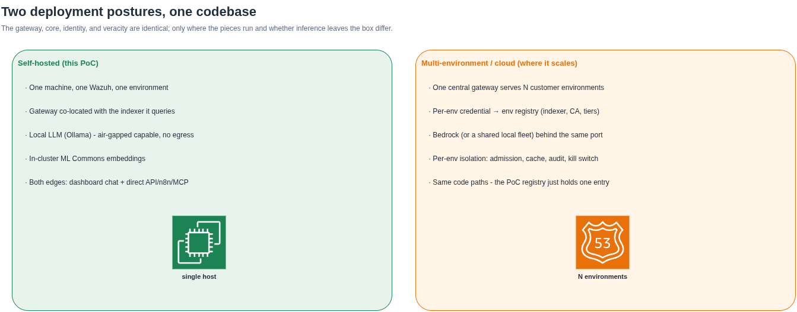

## Enhancement pass (as built)

`wazuh-ai-enhancements.drawio` - the scope classifier, near-miss few-shot, knowledge tool, caching, and the local AMD test harness, with measured golden-set results.

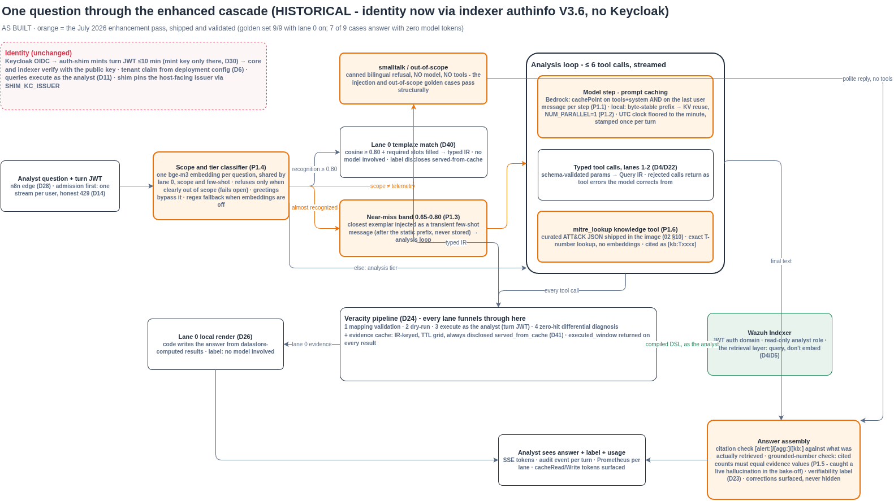
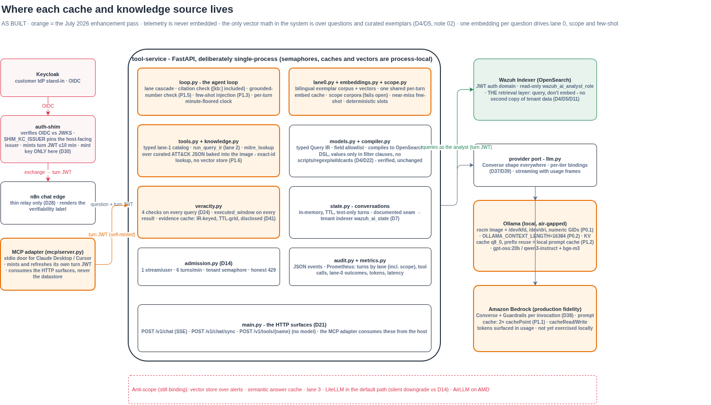
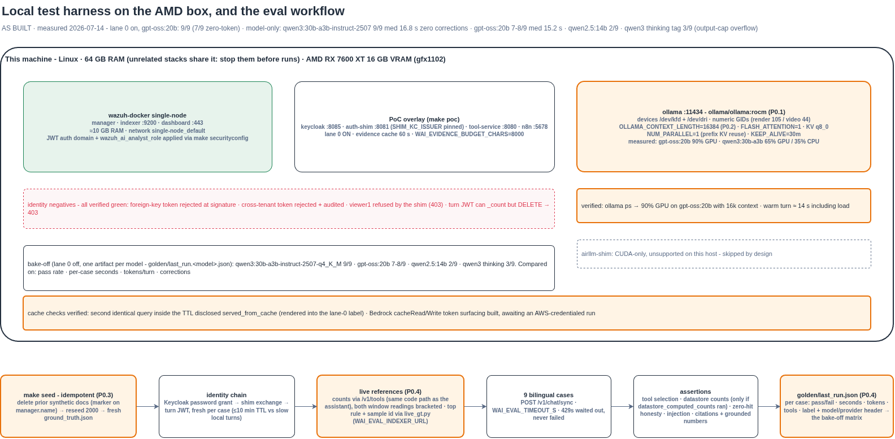

## Original self-hosted PoC (historical, v1/v2)

`wazuh-ai-poc-architecture.drawio` - the original eight-diagram deck. The veracity core it describes (lanes, the four checks, the local harness) is unchanged; the topology and identity have since moved to the v3 set above.

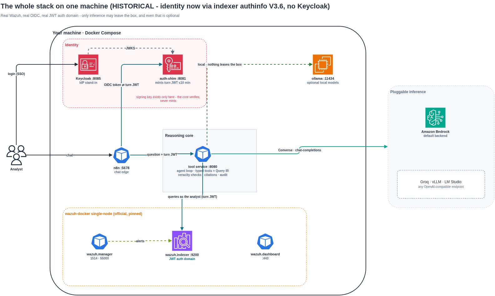
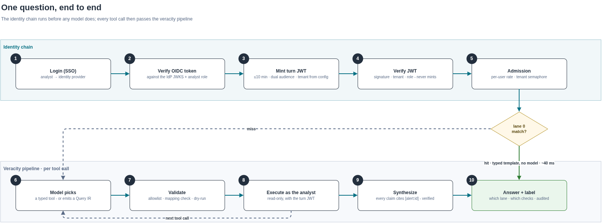
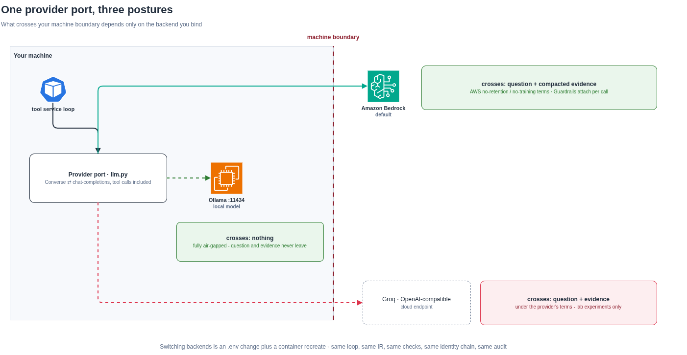
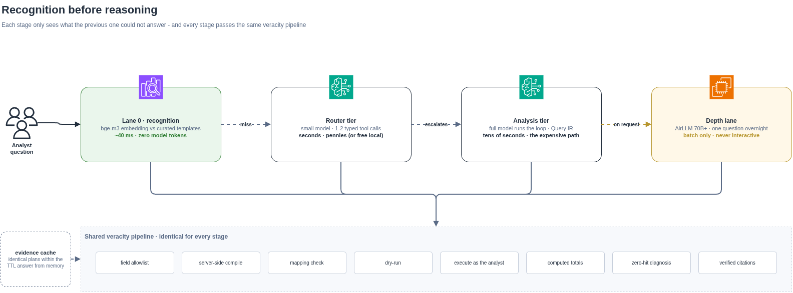
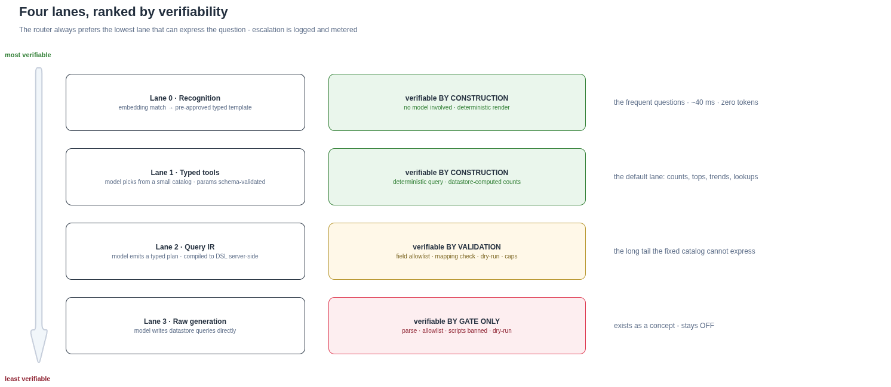
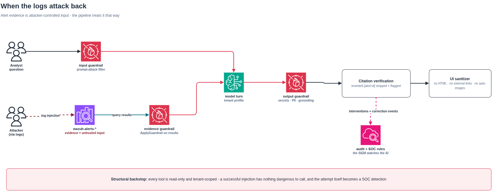
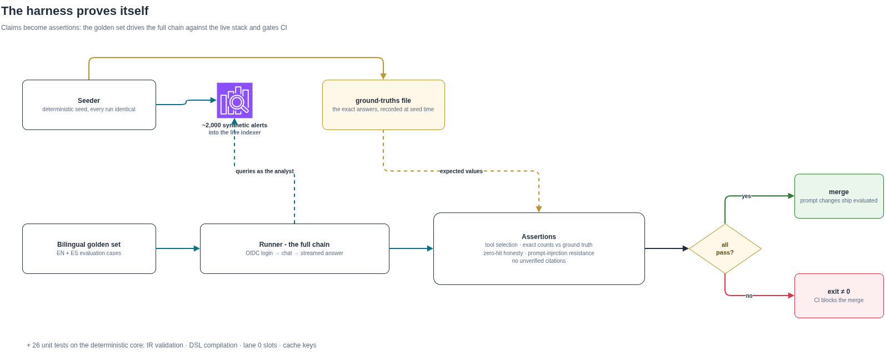
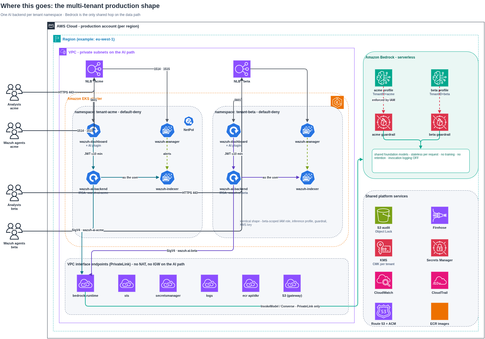
