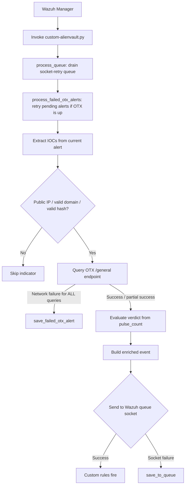

# AlienVault OTX Integration with Wazuh

* [AlienVault OTX Integration with Wazuh](#alienvault-otx-integration-with-wazuh)
* [Prerequisites](#prerequisites)
  * [Installing Wazuh](#installing-wazuh)
  * [Obtaining an OTX API key](#obtaining-an-otx-api-key)
    * [Testing connection from Wazuh to AlienVault OTX](#testing-connection-from-wazuh-to-alienvault-otx)
* [AlienVault OTX‑Wazuh Integration](#alienvault-otxwazuh-integration)
  * [Integration Steps](#integration-steps)
    * [Step 1: Add the Python script and rules](#step-1-add-the-python-script-and-rules)
    * [Step 2: Configure the integration in Wazuh](#step-2-configure-the-integration-in-wazuh)
* [Integration Testing](#integration-testing)
  * [Sample test logs](#sample-test-logs)
  * [Check enriched alerts](#check-enriched-alerts)
* [Workflow](#workflow)
* [IOC Extraction](#ioc-extraction)
* [Verdict Logic](#verdict-logic)
* [Custom Rules](#custom-rules)
* [Reliability and Queueing](#reliability-and-queueing)
* [Logging](#logging)
* [Dashboard](#dashboard)
* [Sources](#sources)


This integration enriches Wazuh alerts with threat intelligence from AlienVault OTX. For each alert that exceeds the configured severity threshold, the script extracts indicators of compromise (source/destination IPs, domains, SHA‑256 file hashes), queries the OTX `/general` endpoint for each one, and emits an enriched event back into the Wazuh pipeline carrying a per‑IOC verdict (`malicious` / `clean` / `unknown`) plus an overall verdict for the alert as a whole. Custom Wazuh rules then act on those verdicts to produce a tiered alert hierarchy. A bundled OpenSearch Dashboards saved‑objects bundle gives you a ready‑to‑use threat‑intelligence dashboard.

> **Note:** OTX is a community‑driven feed. Indicators on shared infrastructure (cloud‑hosted IPs, mail‑sender ranges, CDN endpoints) often return `clean` even when the underlying activity is malicious in your environment. This integration is best used alongside, not instead of, your other detection signals.


## Prerequisites

* Wazuh Manager
* Python 3.8+ (Wazuh ships its own interpreter at `/var/ossec/framework/python/bin/python3`)
* `requests` Python library installed for the Wazuh runtime
* Network connectivity from Wazuh Manager to `https://otx.alienvault.com` (HTTPS)
* A free OTX account with API key

### Installing Wazuh

* Wazuh offers an installation method called [Quickstart](https://documentation.wazuh.com/current/quickstart.html)
* Download and run the [Wazuh installation assistant](https://documentation.wazuh.com/current/installation-guide/wazuh-indexer/installation-assistant.html)
* Once installation is complete, the assistant will provide a username and password for the indexer

### Obtaining an OTX API key

* Sign up at <https://otx.alienvault.com/>
* Navigate to **Settings → User Settings → API Integration**
* Copy the OTX Key. It is a 64‑character hex string.

#### Testing connection from Wazuh to AlienVault OTX

From the Wazuh manager, replacing `<YOUR_OTX_KEY>` with your key:

```bash
curl -s -H "X-OTX-API-KEY: <YOUR_OTX_KEY>" \
  "https://otx.alienvault.com/api/v1/user/me" | jq .
```

A successful response returns your OTX user profile. The integration's
built‑in health check uses this same endpoint.


## AlienVault OTX‑Wazuh Integration

### Integration Steps

#### Step 1: Add the Python script and rules

<details>
<summary>Click to expand integration script configuration steps</summary>

* Place [the Python script](custom-alienvault.py) at `/var/ossec/integrations/custom-alienvault.py`
* Place [the bash wrapper](custom-alienvault) at `/var/ossec/integrations/custom-alienvault`
* Place [the custom rules](alienvault_otx_rules.xml) at `/var/ossec/etc/rules/alienvault_otx_rules.xml`

* Set permissions on the integration files:

```bash
cd /var/ossec/integrations/
sudo chown root:wazuh custom-alienvault* && sudo chmod 750 custom-alienvault*
sudo chown wazuh:wazuh /var/ossec/etc/rules/alienvault_otx_rules.xml
sudo chmod 640 /var/ossec/etc/rules/alienvault_otx_rules.xml
```

* Create the log and queue directories with the right ownership:

```bash
sudo mkdir -p /var/log/wazuh-alienvault/wazuh-retry-queue
sudo mkdir -p /var/log/wazuh-alienvault/otx-failed-enrichment
sudo chown -R wazuh:wazuh /var/log/wazuh-alienvault
sudo chmod 750 /var/log/wazuh-alienvault \
                /var/log/wazuh-alienvault/wazuh-retry-queue \
                /var/log/wazuh-alienvault/otx-failed-enrichment
```

* Install the `requests` library into the Wazuh Python runtime:

```bash
/var/ossec/framework/python/bin/pip3 install requests
```

</details>

#### Step 2: Configure the integration in Wazuh

<details>
<summary>Click to expand Wazuh integration configuration steps</summary>

Edit `/var/ossec/etc/ossec.conf` and add the integration block:

```xml
<integration>
  <name>custom-alienvault</name>
  <hook_url>https://otx.alienvault.com</hook_url>
  <api_key>YOUR_OTX_API_KEY</api_key>
  <alert_format>json</alert_format>
  <level>5</level>
</integration>
```

* **`hook_url`**: OTX base URL. No trailing slash.
* **`api_key`**: Your OTX API key.
* **`level`**: Minimum alert level for the integration to fire. Tune this to control OTX query volume and stay within rate limits.

Restart the Wazuh manager:

```bash
systemctl restart wazuh-manager
```

</details>


## Integration Testing

### Sample test logs

The repository ships a [sample log file](sample-logs.log) you can append to a Wazuh‑monitored log (for example `/var/log/auth.log` or any path declared via `<localfile>`) to generate alerts that contain known‑malicious indicators. OTX pulse contents change daily, so before relying on a specific IP/domain/hash for testing, verify it has pulses:

```bash
curl -s -H "X-OTX-API-KEY: $OTX_KEY" \
  "https://otx.alienvault.com/api/v1/indicators/IPv4/<IP>/general" | \
  jq '.pulse_info.count'
```

For populating the dashboard with a varied dataset, the
[populate_otx_dashboard.py](populate_otx_dashboard.py) helper generates
a set of synthetic alerts spanning multiple Wazuh log sources and runs
each through the integration:

```bash
sudo -u wazuh OTX_KEY=$OTX_KEY \
  /var/ossec/framework/python/bin/python3 populate_otx_dashboard.py
```

### Check enriched alerts

<details>
<summary>Click to expand event checking steps</summary>

* On the Wazuh dashboard, filter for `data.integration: alienvault_otx`
* Or tail the archives on the manager:

```bash
tail -f /var/ossec/logs/archives/archives.json | grep --line-buffered alienvault_otx | jq .
```

You should see events of the form:

```json
{
  "integration": "alienvault_otx",
  "overall_malicious": true,
  "overall_verdict": "malicious",
  "indicators": {
    "src_ip": {
      "value": "203.0.113.45",
      "malicious": true,
      "verdict": "malicious",
      "confidence": "high",
      "pulse_count": 12,
      "pulse_names": ["Emotet C2", "..."],
      "malware_families": ["Emotet"]
    }
  }
}
```

</details>


<div align="center">

## Workflow



</div>


## IOC Extraction

Field paths are declared centrally in `SUPPORTED_FIELD_PATHS` at the top of the script. To support a new log source, add the relevant dotted path under the matching IOC type — no other code change is required:

```python
SUPPORTED_FIELD_PATHS = {
    "src_ip": [
        "srcip",
        "data.srcip",
        "data.aws.ClientIP",
        # add new field paths here ...
    ],
    "dst_ip":   [...],
    "domain":   [...],
    "file_hash":[...],
}
```

Sources covered out of the box:

| Source | Fields |
|---|---|
| Generic Wazuh | `srcip`, `dstip`, `domain` |
| AWS CloudTrail / Wazuh AWS module | `data.aws.ClientIP`, `sourceIPAddress`, `destinationIPAddress` |
| Windows Sysmon | `data.win.eventdata.ipAddress`, `queryName`, `destinationIp`, `Image`, `hashes` (parsed) |
| Office 365 / Microsoft Graph | `ClientIPAddress`, `SenderIp`, plus the structured `evidence[]` array |
| GCP / Azure | `data.gcp.jsonPayload.sourceIP`, `data.azure.properties.ipAddress` |
| Suricata / Zeek | `data.suricata.src_ip`, `data.zeek.id_orig_h`, etc. |
| Wazuh FIM | `syscheck.sha256_after` |
| VirusTotal integration | `data.virustotal.source.sha256` |
| Osquery | `data.osquery.columns.sha256` |

Sources whose data needs structural parsing (Sysmon's comma‑separated `hashes` string, MS Graph `evidence` arrays) are handled by dedicated extractor functions rather than the path map.

Additional safeguards before an indicator is sent to OTX:

* **IPs**: only globally‑routable addresses are queried. RFC1918 private space, loopback, link‑local, CGNAT, and reserved/multicast ranges are filtered out — they cannot meaningfully be looked up in a public threat‑intelligence feed.
* **Domains**: scheme/path/port/query are stripped, and the result is rejected if it parses as an IP, contains whitespace, or has no dot.
* **Hashes**: validated against a 64‑character hex pattern.


## Verdict Logic

For each indicator the script translates the OTX `pulse_info.count` — the number of community pulses referencing the indicator — into a verdict and a confidence tier:

| `pulse_count` | `verdict` | `confidence` |
|---|---|---|
| 0 | `clean` | `high` |
| 1 | `malicious` | `low` |
| 2–4 | `malicious` | `medium` |
| ≥ 5 | `malicious` | `high` |
| query failed / no response | `unknown` | `unknown` |

Two top‑level fields summarise the alert: `overall_malicious` (boolean) and `overall_verdict` (`malicious` / `clean` / `partial_unknown`). The first up to five non‑empty pulse names, adversary tags, and malware‑family names are also included to keep the enriched event compact while still actionable.

> **A note on the OTX `reputation` field.** The OTX API documents a `reputation` score on IPv4 indicators, but in practice it consistently returns `0` regardless of how malicious an indicator is, and the field is absent entirely from domain and file responses. This integration therefore keys verdicts solely on `pulse_info.count` and does not surface the reputation field in the enriched alert.


## Custom Rules

The bundled rules use IDs in the user range 100010–100024 and chain off the base rule:

| Rule ID | Level | Triggers when |
|---|---|---|
| 100010 / 100017 | 3 | Any AlienVault OTX enrichment event (base) |
| 100019 | 2 | All indicators in the event are clean |
| 100018 | 3 | Event dropped by Wazuh integrator (>60KB) |
| 100011 | 10 | Malicious file hash |
| 100014 | 10 | Malicious destination IP |
| 100015 | 10 | Malicious source IP |
| 100016 | 10 | Malicious domain |
| 100012 | 12 | Malicious file hash + destination IP |
| 100013 | 13 | Malicious file hash + destination IP + source IP |
| 100021–100024 | 12 | High‑confidence malicious indicator (5+ pulses) |


## Reliability and Queueing

The integration uses two independent on‑disk queues to prevent transient failures from causing dropped enrichments. Both live under `/var/log/wazuh-alienvault/`:

```
/var/log/wazuh-alienvault/
├── custom-alienvault.log           ← rotating service log (10MB × 5 backups)
├── wazuh-retry-queue/
│   └── alienvault_queue.json       ← socket-retry queue
└── otx-failed-enrichment/
    └── alert_<id>.json             ← one file per alert pending re-enrichment
```

### Socket‑retry queue (`alienvault_queue.json`)

Catches the case where an enrichment was successfully built but couldn't be delivered to the Wazuh manager's `queue` UNIX socket — for example during a manager restart. Each failed event is appended to the queue file as a single newline‑delimited line containing the exact socket payload that was about to be sent. On the next invocation, `process_queue` rotates the file to `.inprocess`, replays each line, and only deletes lines that succeed; anything that still fails is preserved for the next run.

This queue does **not** require an OTX round‑trip on retry — the enrichment is already done — so it drains very quickly once the local socket is back.

### Failed‑enrichment queue (`otx-failed-enrichment/`)

Catches the case where OTX itself is unreachable (network down, OTX outage, rate limit). When **every** OTX query for an alert returns a recoverable failure (timeout, connection error, HTTP 429, HTTP 5xx), the original alert is written to a per‑alert JSON file in this directory. On the next invocation, the script performs a quick OTX health check (`GET /api/v1/user/me`); if successful, every queued alert is re‑enriched and emitted, and its file is removed. If OTX is still down, the queue is left intact for a future attempt.

Note that **partial** OTX failures (e.g., the source‑IP query succeeded but the file‑hash query timed out) do not trigger queueing — the alert is still emitted with whatever enrichment was obtained, and the failed indicator is recorded with `verdict: unknown`. Queueing only kicks in when the script has effectively no OTX information at all.

### Triggering retry

Because the integration is invoked once per Wazuh alert, queue drainage is opportunistic: the next alert that flows through the integration is what triggers retry of any backlog. In an active environment this is essentially continuous. If you need to force a drain (for example after a long OTX outage in a quiet environment), invoke the script manually with any alert file:

```bash
/var/ossec/integrations/custom-alienvault.py /tmp/anyalert.json \
  $OTX_KEY https://otx.alienvault.com debug
```

The `process_queue` and `process_failed_otx_alerts` calls run before the new alert is processed, so even a single manual run is enough.


## Logging

* All script output goes to `/var/log/wazuh-alienvault/custom-alienvault.log` via a rotating file handler (10 MB per file, 5 backups).
* Pass `debug` as the fourth argument to enable DEBUG‑level output. The Wazuh integrator does this automatically when you set `<integration_debug>1</integration_debug>` inside the integration block, or you can invoke the script manually.
* Log lines include service name, level, and timestamp:

  ```
  2026-05-01 11:36:53,385 [INFO]  wazuh-alienvault-integration: Starting; alert=...
  2026-05-01 11:36:55,012 [WARN]  wazuh-alienvault-integration: OTX rate limit hit (429). Will retry later.
  2026-05-01 11:36:55,013 [WARN]  wazuh-alienvault-integration: All 2 OTX queries failed for alert test.001. Queuing for retry.
  ```

The standard Wazuh `/var/ossec/logs/integrations.log` is no longer written to by this integration; everything is centralised under `/var/log/wazuh-alienvault/` so the logs can be rotated and analysed independently of the rest of the Wazuh manager.


## Dashboard

The repository ships a saved‑objects bundle, [`wazuh-otx-dashboard.ndjson`](wazuh-otx-dashboard.ndjson), with **14 visualisations and 1 dashboard** scoped to `data.integration: alienvault_otx`. Once imported, you get a single‑pane view of all OTX enrichment activity:

| Row | Panels |
|---|---|
| 1 (metrics) | Total Enrichments · Malicious Events · Clean Events · Unique Malicious Source IPs |
| 2 | Overall Verdict Distribution (donut) · Verdict Timeline (stacked area) |
| 3 | Malicious Events by IOC Type (horizontal bar) · Top Adversaries (tag cloud) · Top Malware Families (tag cloud) |
| 4 | Top Malicious Source IPs (table) · Top Malicious Destination IPs (table) |
| 5 | Top Malicious Domains (table) · Top Malicious File Hashes (table) |
| 6 | Top Wazuh Rules Producing Enrichments (full‑width table) |

### Importing the dashboard

<details>
<summary>Click to expand dashboard import steps</summary>

1. Open the Wazuh dashboard in your browser.
2. Navigate to **Stack Management → Saved Objects**.
3. Click **Import** in the upper‑right.
4. Select `wazuh-otx-dashboard.ndjson`.
5. Choose **Automatically overwrite all conflicts** (or **Request action on conflict** for a fresh import).
6. Click **Import**.
7. Open the **Dashboards** menu — the new dashboard appears as **AlienVault OTX | Threat Intelligence**.

If your index pattern saved‑object ID is anything other than the literal string `wazuh-alerts-*`, the importer will surface a conflicts dialog and let you remap each visualisation.

After the first import, refresh the field list once: **Stack Management → Index Patterns → wazuh-alerts-* → refresh icon**. This ensures the new `data.indicators.*` fields are recognised by the visualisation aggregations.

</details>

### Populating the dashboard with sample data

For an empty environment (e.g. a fresh lab), generate a varied set of synthetic alerts using the [`populate_otx_dashboard.py`](populate_otx_dashboard.py) helper:

```bash
sudo -u wazuh OTX_KEY=$OTX_KEY \
  /var/ossec/framework/python/bin/python3 populate_otx_dashboard.py
```

The helper drives 21 distinct scenarios spanning SSH brute‑force, web scanning, Sysmon DNS queries, FIM events, Suricata C2 detections, MS Graph mail evidence, AWS CloudTrail and outbound firewall connections — touching every panel of the dashboard with a mix of malicious and clean indicators.

### Notes on aggregation field types

The dashboard's IOC tables use **Top Hits** rather than **Max** for the `pulse_count` column. This is deliberate: Wazuh's default index template stores all `data.*` fields as `keyword`, including numeric‑looking strings like `pulse_count`. Top Hits works on any field type and avoids the "invalid for use with the Max aggregation" error that would otherwise appear. If you've customised your index template to give `pulse_count` an explicit `long` mapping, switching the column back to Max in the visualisation editor will give you a true per‑indicator maximum across the time window.


## Sources

<details>
<summary>Click to expand source references</summary>

* AlienVault OTX API reference: <https://otx.alienvault.com/api>
* Wazuh integrator documentation: <https://documentation.wazuh.com/current/user-manual/manager/manual-integration.html>
* Wazuh ruleset rule syntax: <https://documentation.wazuh.com/current/user-manual/ruleset/ruleset-xml-syntax/rules.html>
* OpenSearch Dashboards saved‑objects API: <https://opensearch.org/docs/latest/dashboards/management/saved-objects/>

</details>