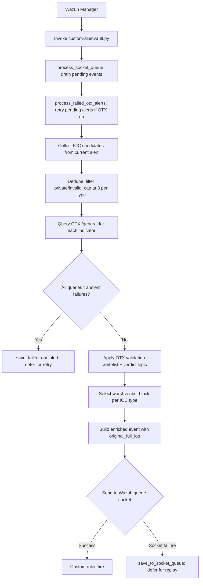

# AlienVault OTX Integration with Wazuh

* [AlienVault OTX Integration with Wazuh](#alienvault-otx-integration-with-wazuh)
* [Prerequisites](#prerequisites)
  * [Obtaining an OTX API key](#obtaining-an-otx-api-key)
    * [Testing connection from Wazuh to AlienVault OTX](#testing-connection-from-wazuh-to-alienvault-otx)
* [AlienVault OTX-Wazuh Integration](#alienvault-otx-wazuh-integration)
  * [Integration Steps](#integration-steps)
    * [Step 1: Add the Python script and rules](#step-1-add-the-python-script-and-rules)
    * [Step 2: Configure the integration in Wazuh](#step-2-configure-the-integration-in-wazuh)
* [Integration Testing](#integration-testing)
  * [Sample test logs](#sample-test-logs)
  * [Check enriched alerts](#check-enriched-alerts)
* [Workflow](#workflow)
* [IOC Extraction](#ioc-extraction)
  * [Field sources covered out of the box](#field-sources-covered-out-of-the-box)
  * [Multi-indicator handling](#multi-indicator-handling)
  * [Sender-domain filtering](#sender-domain-filtering)
  * [CrowdStrike `IOCValue` dispatch](#crowdstrike-iocvalue-dispatch)
* [Verdict Logic](#verdict-logic)
  * [OTX `validation` override](#otx-validation-override)
* [Custom Rules](#custom-rules)
* [Reliability and Queueing](#reliability-and-queueing)
  * [Socket-retry queue](#socket-retry-queue)
  * [Failed-enrichment queue](#failed-enrichment-queue)
  * [Triggering retry](#triggering-retry)
* [Logging](#logging)
* [Dashboard](#dashboard)
* [Sources](#sources)


This integration enriches Wazuh alerts with threat intelligence from AlienVault OTX. For each alert that exceeds the configured severity threshold, the script extracts indicators of compromise (source/destination IPs, domains, SHA-256 file hashes), queries the OTX `/general` endpoint for each one, and emits an enriched event back into the Wazuh pipeline carrying a per-IOC verdict (`malicious` / `clean` / `unknown`) plus an overall verdict for the alert as a whole. Custom Wazuh rules then act on those verdicts to produce a tiered alert hierarchy. A bundled OpenSearch Dashboards saved-objects bundle gives you a ready-to-use threat-intelligence dashboard.

> **Note:** OTX is a community-driven feed. Indicators on shared infrastructure (cloud-hosted IPs, mail-sender ranges, CDN endpoints) often return `clean` even when the underlying activity is malicious in your environment. This integration is best used alongside, not instead of, your other detection signals.

## Prerequisites

* `requests` Python library installed for the Wazuh runtime
* Network connectivity from Wazuh Manager to `https://otx.alienvault.com` (HTTPS)
* A free OTX account with API key

### Obtaining an OTX API key

* Sign up at <https://otx.alienvault.com/>
* Navigate to **Settings --> User Settings --> API Integration**
* Copy the OTX Key. It is a 64-character hex string.

#### Testing connection from Wazuh to AlienVault OTX

From the Wazuh manager, replacing `<YOUR_OTX_KEY>` with your key:

```bash
curl -s -H "X-OTX-API-KEY: <YOUR_OTX_KEY>" \
  "https://otx.alienvault.com/api/v1/user/me" | jq .
```

A successful response returns your OTX user profile.


## AlienVault OTX-Wazuh Integration

### Integration Steps

#### Step 1: Add the Python script and rules

<details>
<summary>Click to expand integration script configuration steps</summary>

* Place [the Python script](custom-alienvault.py) at `/var/ossec/integrations/custom-alienvault.py`
* Place [the bash wrapper](custom-alienvault) at `/var/ossec/integrations/custom-alienvault`
* Place [the custom rules](alienvault_otx_rules.xml) at `/var/ossec/etc/rules/alienvault_otx_rules.xml`

* Set permissions on the integration files:

```bash
cd /var/ossec/integrations/
sudo chown root:wazuh custom-alienvault* && sudo chmod 750 custom-alienvault*
sudo chown wazuh:wazuh /var/ossec/etc/rules/alienvault_otx_rules.xml
sudo chmod 640 /var/ossec/etc/rules/alienvault_otx_rules.xml
```

* Install the `requests` library into the Wazuh Python runtime:

```bash
/var/ossec/framework/python/bin/pip3 install requests
```

* Create the log + queue directories with the right ownership:

```bash
sudo mkdir -p /var/log/wazuh-alienvault/wazuh-retry-queue
sudo mkdir -p /var/log/wazuh-alienvault/otx-failed-enrichment
sudo chown -R wazuh:wazuh /var/log/wazuh-alienvault
sudo chmod 750 /var/log/wazuh-alienvault \
                /var/log/wazuh-alienvault/wazuh-retry-queue \
                /var/log/wazuh-alienvault/otx-failed-enrichment
```

If these directories don't exist when the script starts, it will try to create them on first use and fall back to stderr-only logging if it can't. Pre-creating them with the correct ownership is the recommended approach.

</details>

#### Step 2: Configure the integration in Wazuh

<details>
<summary>Click to expand Wazuh integration configuration steps</summary>

Edit `/var/ossec/etc/ossec.conf` and add the integration block:

```xml
<integration>
  <name>custom-alienvault</name>
  <hook_url>https://otx.alienvault.com</hook_url>
  <api_key>YOUR_OTX_API_KEY</api_key>
  <alert_format>json</alert_format>
  <level>5</level>
</integration>
```

* **`hook_url`**: OTX base URL. No trailing slash.
* **`api_key`**: Your OTX API key.
* **`level`**: Minimum alert level for the integration to fire. Tune this to control OTX query volume and stay within rate limits.

Restart the Wazuh manager:

```bash
systemctl restart wazuh-manager
```

</details>


## Integration Testing

### Sample test logs

The repository ships a [sample log file](sample-logs.log) you can append to a Wazuh-monitored log (for example `/var/log/auth.log` or any path declared via `<localfile>`) to generate alerts that contain known-malicious indicators. OTX pulse contents change daily, so before relying on a specific IP/domain/hash for testing, verify it has pulses:

```bash
curl -s -H "X-OTX-API-KEY: $OTX_KEY" \
  "https://otx.alienvault.com/api/v1/indicators/IPv4/<IP>/general" | \
  jq '.pulse_info.count'
```

For populating the dashboard with a varied dataset, the [populate_otx_dashboard.py](populate_otx_dashboard.py) helper generates a set of synthetic alerts spanning multiple Wazuh log sources and runs each through the integration:

```bash
sudo -u wazuh OTX_KEY=$OTX_KEY \
  /var/ossec/framework/python/bin/python3 populate_otx_dashboard.py
```

### Check enriched alerts

<details>
<summary>Click to expand event checking steps</summary>

* On the Wazuh dashboard, filter for `data.integration: alienvault_otx`
* Or tail the archives on the manager:

```bash
tail -f /var/ossec/logs/archives/archives.json | grep --line-buffered alienvault_otx | jq .
```

You should see events of the form:

```json
{
  "integration": "alienvault_otx",
  "original_rule": "5712",
  "input_alert": "1777630620.14970618",
  "overall_malicious": true,
  "overall_verdict": "malicious",
  "indicators": {
    "src_ip": {
      "value": "203.0.113.45",
      "malicious": true,
      "verdict": "malicious",
      "confidence": "high",
      "pulse_count": 12,
      "pulse_names": ["Emotet C2", "..."],
      "malware_families": ["Emotet"]
    }
  },
  "original_full_log": "Sep 1 12:34:56 host sshd[123]: Failed password..."
}
```

The `original_full_log` field preserves the raw log line from the source alert so analysts can pivot back to the original event without needing to correlate by alert ID. If preserving the full log is a storage concern in your environment (some `full_log` values can be 5-10 KB), the relevant line in `enrich_alert` is easy to truncate.

</details>


<div align="center">

## Workflow



</div>


## IOC Extraction

Field paths are declared centrally in `SUPPORTED_FIELD_PATHS` at the top of the script. To support a new log source, add the relevant dotted path under the matching IOC type - no other code change is required:

```python
SUPPORTED_FIELD_PATHS = {
    "src_ip": [
        "srcip",
        "data.srcip",
        "data.source_address",
        "data.aws.ClientIP",
        # add new field paths here ...
    ],
    "dst_ip":   [...],
    "domain":   [...],
    "file_hash":[...],
}
```

Additional safeguards before an indicator is sent to OTX:

* **IPs**: only globally-routable addresses are queried. RFC1918 private space, loopback, link-local, CGNAT, and reserved/multicast ranges are filtered out as they cannot meaningfully be looked up in a public threat-intelligence feed.
* **Domains**: scheme/path/port/query are stripped, and the result is rejected if it parses as an IP, contains whitespace, or has no dot.
* **Hashes**: validated against a 64-character hex pattern. MD5 and SHA-1 are not extracted because OTX's `/file/` endpoint only resolves SHA-256.

### Field sources covered out of the box

| Source | Fields |
|---|---|
| Generic Wazuh | `srcip`, `dstip`, `domain`, `data.source_address`, `data.destination_address`, `data.nat_source_ip`, `data.nat_destination_ip` |
| AWS CloudTrail / Wazuh AWS module | `data.aws.ClientIP`, `data.aws.source_ip_address`, `data.aws.sourceIPAddress`, `data.aws.destinationIPAddress` |
| Cloudflare module | `data.aws.ClientIP`, `data.aws.OriginIP` (shares the AWS module schema) |
| Wazuh DNS module | `data.Remote_IP` |
| Windows Sysmon | `data.win.eventdata.ipAddress`, `destinationIp`, `queryName`, `destinationHostname`, `Image`, `hashes` (parsed for SHA-256) |
| Office 365 / Microsoft Graph | `data.office365.ClientIPAddress`, `ClientIP`, `SenderIp`, plus the structured `data.ms-graph.evidence[]` array (URLs and sender objects) |
| GCP / Azure | `data.gcp.jsonPayload.sourceIP`, `data.azure.properties.ipAddress` |
| Suricata / Zeek | `data.suricata.src_ip`, `data.suricata.dest_ip`, `data.suricata.dns.rrname`, `data.zeek.id_orig_h`, `data.zeek.id_resp_h` |
| Wazuh FIM | `syscheck.sha256_after` |
| VirusTotal integration | `data.virustotal.source.sha256` |
| Osquery | `data.osquery.columns.sha256` |
| CrowdStrike Falcon | `data.event.IOCValue` (dispatched on `IOCType`), `data.event.SHA256String`, `data.event.QuarantineFiles[].SHA256HashData` |

Sources whose data needs structural parsing - Sysmon's comma-separated `hashes` string, MS Graph `evidence` arrays, CrowdStrike's `QuarantineFiles[]` array, the `IOCType`/`IOCValue` discriminated union - are handled by dedicated extractor functions rather than the path map.

### Multi-indicator handling

A single Wazuh alert frequently contains multiple candidates for the same IOC type - for example, AWS CloudTrail records both `sourceIPAddress` and `ClientIP`, and a NAT-traversing flow contributes both `srcip` and `nat_source_ip`. The script:

1. Walks **every** registered path for the IOC type and collects all values.
2. Deduplicates while preserving the path order, so the most authoritative field wins on ties.
3. Filters out RFC1918/loopback/etc. addresses, invalid domains, and non-SHA-256 hashes.
4. Caps the surviving candidates at `MAX_QUERIES_PER_TYPE = 3` to stay within OTX rate limits. Dropped values are logged with a `WARNING` naming the specific indicators that were not queried.
5. Queries OTX for every kept candidate and picks the **worst** verdict block as the value for that IOC type in the emitted event. Ranking is `(verdict_score, pulse_count)` where malicious > clean > unknown.

This means the alert shape stays identical to a single-value enrichment (one block per IOC type), so existing dashboard panels and rules continue to work, but the enrichment itself is robust to alerts that happen to mention several IPs or hashes.

### Sender-domain filtering

For alerts carrying email evidence (MS Graph `p1Sender` / `p2Sender`, Office 365 `SenderAddress`), the sender domain is only used as a domain IOC when:

* No structural domain (Sysmon `queryName`, URL evidence, etc.) was already found in the alert, **and**
* The sender domain is not in `MAIL_INFRASTRUCTURE_DOMAINS` - the built-in skip list of major webmail providers (gmail.com, outlook.com, yahoo.com, protonmail.com, icloud.com, aol.com, and their regional variants).

The motivation is concrete: popular mail platforms accumulate OTX pulses because attackers abuse them as phishing lure hosts, but the domains themselves are not malicious infrastructure. Querying them produces false positives that flood the dashboard. Non-webmail sender domains (e.g. `attacker@suspicious-domain.ru`) are still extracted and queried normally.

### CrowdStrike `IOCValue` dispatch

CrowdStrike's `DetectionSummaryEvent` carries IOCs through a discriminated union: `data.event.IOCValue` is type-tagged by the sibling `data.event.IOCType` field. The script dispatches on `IOCType`:

| `IOCType` | Routed to |
|---|---|
| `hash_sha256`, `sha256` | `file_hash` |
| `domain` | `domain` |
| `ipv4`, `ipv6` | `dst_ip` (Falcon IOCs typically represent the externally-observed peer) |
| anything else (`hash_md5`, `hash_sha1`, registry, etc.) | skipped (not OTX-resolvable) |

If your CrowdStrike pulses tend to record inbound-attacker IPs rather than outbound peers and you'd prefer `ipv4`/`ipv6` to land in `src_ip`, change one line in `_classify_crowdstrike_ioc`.


## Verdict Logic

For each indicator the script translates the OTX `pulse_info.count`, the number of community pulses referencing the indicator, into a verdict and a confidence tier:

| `pulse_count` | OTX `validation` | `verdict` | `confidence` |
|---|---|---|---|
| any | contains `whitelist`, `false_positive`, `majestic`, `alexa`, or `akamai` | `clean` | `high` |
| 0 | - | `clean` | `high` |
| 1 | - | `malicious` | `low` |
| 2-4 | - | `malicious` | `medium` |
| >= 5 | - | `malicious` | `high` |
| query failed / no response | - | `unknown` | `unknown` |

Two top-level fields summarise the alert: `overall_malicious` (boolean) and `overall_verdict` (`malicious` / `clean` / `partial_unknown`). The first up to five non-empty pulse names, adversary tags, and malware-family names are also included to keep the enriched event compact while still actionable.

> **A note on the OTX `reputation` field.** The OTX API documents a `reputation` score on IPv4 indicators, but in practice it consistently returns `0` regardless of how malicious an indicator is, and the field is absent entirely from domain and file responses. This integration therefore keys verdicts solely on `pulse_info.count` and does not surface the reputation field in the enriched alert.

### OTX `validation` override

Some indicators legitimately have a non-zero `pulse_count` but are explicitly marked by OTX as known-good: popular domains like `google.com` or `gmail.com` show up in phishing pulses because attackers abuse them, not because the domains themselves are malicious. OTX exposes this in the response's `validation[]` array, with entries whose `source` field takes values like `whitelist`, `false_positive`, `majestic`, `alexa`, or `akamai`.

The script reads this array before evaluating the pulse count. If any entry's source is in `OTX_WHITELIST_VALIDATION_SOURCES`, the indicator is marked `verdict: clean, reason: otx_whitelist_validation` regardless of how many pulses reference it. The raw `pulse_count` is still included in the emitted block for transparency.


## Custom Rules

The bundled rules use IDs in the user range 100010-100024 and chain off the base rule:

| Rule ID | Level | Triggers when |
|---|---|---|
| 100010 / 100017 | 3 | Any AlienVault OTX enrichment event (base) |
| 100019 | 2 | All indicators in the event are clean |
| 100018 | 3 | Event dropped by Wazuh integrator (>60KB) |
| 100011 | 10 | Malicious file hash |
| 100014 | 10 | Malicious destination IP |
| 100015 | 10 | Malicious source IP |
| 100016 | 10 | Malicious domain |
| 100012 | 12 | Malicious file hash + destination IP |
| 100013 | 13 | Malicious file hash + destination IP + source IP |
| 100021-100024 | 12 | High-confidence malicious indicator (5+ pulses) |


## Reliability and Queueing

The integration uses two independent on-disk queues so that transient failures - of either the Wazuh queue socket or the OTX API - never silently drop an enrichment. Both queues live under `/var/log/wazuh-alienvault/`:

```
/var/log/wazuh-alienvault/
+-- custom-alienvault.log           # rotating service log (10MB x 5 backups)
+-- wazuh-retry-queue/
|   +-- alienvault_queue.json       # socket-retry queue (newline-delimited)
+-- otx-failed-enrichment/
    +-- alert_<id>.json             # one file per alert pending re-enrichment
```

### Socket-retry queue

Catches the case where an enrichment was successfully built but the Wazuh manager's queue socket at `/var/ossec/queue/sockets/queue` couldn't be reached - for example during a manager restart. The pre-formatted socket line is appended to `wazuh-retry-queue/alienvault_queue.json` as a newline-delimited JSON record carrying both the enriched event and the original agent context.

On the next invocation, `process_socket_queue` atomically renames the queue file to `.inprocess`, replays every entry, and re-queues only the ones whose replay still fails. This path is cheap because **no OTX round-trip is required** - the enrichment is already done, so the queue drains as fast as the socket can accept it.

### Failed-enrichment queue

Catches the case where OTX itself is unreachable: network outage, OTX downtime, sustained rate-limiting, or auth issues. The script classifies every OTX response into one of four outcomes:

| OTX response | Treatment |
|---|---|
| 200 OK | Normal success - emit verdict |
| 404 Not Found | Indicator absent from OTX - emit `verdict: unknown`, **not** queued |
| 401 Unauthorized | Treated as transient (queueable) - usually means a key rotation problem |
| 429 / 5xx / connection error / timeout | Transient (queueable) |

When **every** OTX query for an alert returns a transient error, the script writes the raw alert to `otx-failed-enrichment/alert_<id>.json` rather than emitting an empty-enrichment event. The next invocation performs a lightweight health check (`GET /api/v1/user/me`) before reading the queue; if OTX is still down the files are left in place, and if OTX has recovered each saved alert is re-enriched and its file is deleted on success.

The distinction between a 404 and a transient failure is deliberate. A 404 just means the indicator isn't in OTX's database - which is a legitimate "OTX has nothing on this" result, not a failure - so the alert is still emitted with `verdict: unknown` for that indicator and the alert is **not** retried. Without this rule, the failed-enrichment directory would fill up with alerts whose indicators OTX simply doesn't know about.

A **partial** OTX failure (one IOC succeeds, another times out) also does not trigger queueing: the alert is emitted with whatever enrichment was obtained, and the failed indicator carries `verdict: unknown`. Queueing kicks in only when the script has effectively no OTX information at all.

### Triggering retry

Because the integration is invoked once per Wazuh alert, queue drainage is opportunistic: the next alert that flows through the integration is what triggers retry of any backlog. In an active environment this is essentially continuous. To force a drain manually (for example after a long OTX outage in a quiet environment), invoke the script with any alert file:

```bash
/var/ossec/integrations/custom-alienvault.py /tmp/anyalert.json \
  $OTX_KEY https://otx.alienvault.com debug
```

The `process_socket_queue` and `process_failed_otx_alerts` calls run before the new alert is processed, so a single manual run is enough.


## Logging

The script logs to a dedicated rotating file at `/var/log/wazuh-alienvault/custom-alienvault.log` (10 MB per file, 5 backups, ~50 MB worst case). Stderr also receives every log line in case the Wazuh integrator captures it. If the log directory isn't writable, the script falls back to stderr-only logging rather than crashing.

Log format:

```
2026-05-13 11:36:53,385 [INFO] custom-alienvault: Starting; alert=/tmp/alert.json hook_url=https://otx.alienvault.com
2026-05-13 11:36:54,012 [WARNING] custom-alienvault: Capped src_ip at 3 of 4 candidates; dropped: ['13.14.15.16']
2026-05-13 11:36:55,011 [WARNING] custom-alienvault: All 2 OTX queries failed transiently for alert test.001; queuing for retry.
2026-05-13 11:36:55,012 [WARNING] custom-alienvault: Alert test.001 saved for retry (OTX unreachable for all IOCs).
2026-05-13 11:36:55,890 [INFO] custom-alienvault: Replayed 3 queued event(s) to the Wazuh socket.
```

## Dashboard

The repository ships a saved-objects bundle, [`wazuh-otx-dashboard.ndjson`](wazuh-otx-dashboard.ndjson), with **14 visualisations and 1 dashboard** scoped to `data.integration: alienvault_otx`. Once imported, you get a single-pane view of all OTX enrichment activity:

| Row | Panels |
|---|---|
| 1 (metrics) | Total Enrichments - Malicious Events - Clean Events - Unique Malicious Source IPs |
| 2 | Overall Verdict Distribution (donut) - Verdict Timeline (stacked area) |
| 3 | Malicious Events by IOC Type (horizontal bar) - Top Adversaries (tag cloud) - Top Malware Families (tag cloud) |
| 4 | Top Malicious Source IPs (table) - Top Malicious Destination IPs (table) |
| 5 | Top Malicious Domains (table) - Top Malicious File Hashes (table) |
| 6 | Top Wazuh Rules Producing Enrichments (full-width table) |

### Importing the dashboard

<details>
<summary>Click to expand dashboard import steps</summary>

1. Open the Wazuh dashboard in your browser.
2. Navigate to **Stack Management --> Saved Objects**.
3. Click **Import** in the upper-right.
4. Select `wazuh-otx-dashboard.ndjson`.
5. Choose **Automatically overwrite all conflicts** (or **Request action on conflict** for a fresh import).
6. Click **Import**.
7. Open the **Dashboards** menu - the new dashboard appears as **AlienVault OTX | Threat Intelligence**.

If your index pattern saved-object ID is anything other than the literal string `wazuh-alerts-*`, the importer will surface a conflicts dialog and let you remap each visualisation.

After the first import, refresh the field list once: **Stack Management --> Index Patterns --> wazuh-alerts-* --> refresh icon**. This ensures the new `data.indicators.*` fields are recognised by the visualisation aggregations.

</details>

### Populating the dashboard with sample data

For an empty environment (e.g. a fresh lab), generate a varied set of synthetic alerts using the [`populate_otx_dashboard.py`](populate_otx_dashboard.py) helper:

```bash
sudo -u wazuh OTX_KEY=$OTX_KEY \
  /var/ossec/framework/python/bin/python3 populate_otx_dashboard.py
```

The helper drives 21 distinct scenarios spanning SSH brute-force, web scanning, Sysmon DNS queries, FIM events, Suricata C2 detections, MS Graph mail evidence, AWS CloudTrail and outbound firewall connections, touching every panel of the dashboard with a mix of malicious and clean indicators.

### Notes on aggregation field types

The dashboard's IOC tables use **Top Hits** rather than **Max** for the `pulse_count` column. This is deliberate: Wazuh's default index template stores all `data.*` fields as `keyword`, including numeric-looking strings like `pulse_count`. Top Hits works on any field type and avoids the "invalid for use with the Max aggregation" error that would otherwise appear. If you've customised your index template to give `pulse_count` an explicit `long` mapping, switching the column back to Max in the visualisation editor will give you a true per-indicator maximum across the time window.


## Sources

<details>
<summary>Click to expand source references</summary>

* AlienVault OTX API reference: <https://otx.alienvault.com/api>
* Wazuh integrator documentation: <https://documentation.wazuh.com/current/user-manual/manager/manual-integration.html>
* Wazuh ruleset rule syntax: <https://documentation.wazuh.com/current/user-manual/ruleset/ruleset-xml-syntax/rules.html>
* OpenSearch Dashboards saved-objects API: <https://opensearch.org/docs/latest/dashboards/management/saved-objects/>
* CrowdStrike Falcon Streaming API event dictionary (for `IOCType` values): <https://falcon.crowdstrike.com/documentation>

</details>