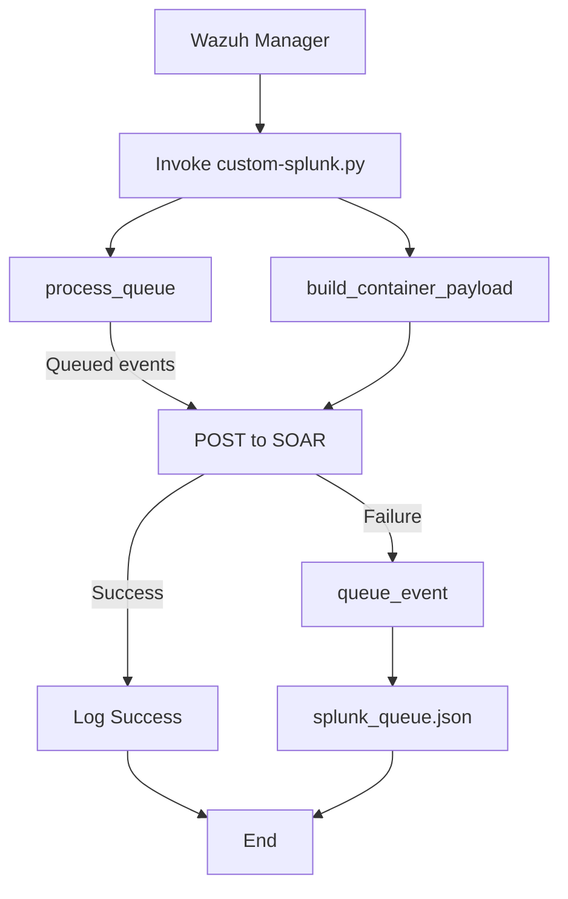

# Splunk SOAR Integration with Wazuh

This integration forwards Wazuh alerts into Splunk SOAR (Privileged On‑Prem) via a Python hook script with built‑in queueing for reliable delivery.

> **Note:** Depending on your event volume, you may experience delays as events are queued and retried on failure.

## 🔧 Prerequisites

* Wazuh Manager (v4.x+)
* Python 3.8+ on Wazuh Manager
* `urllib3` Python library installed
* Network connectivity from Wazuh Manager to Splunk SOAR (HTTPS)
* Splunk SOAR user with API access and token

### Installing Wazuh

- Wazuh offers an installation method called `Quick Start`
- Download and run the Wazuh installation assistant
```bash
curl -sO https://packages.wazuh.com/4.11/wazuh-install.sh && sudo bash ./wazuh-install.sh -a
```
- Once the installation is complete, the assistant will give us a username and password to connect to the indexer

#### Testing connection from Wazuh to Splunk SOAR
To do this you can use the following command from a linux server, and you must replace the ip, and the authorization with the value of the key that you generated:
```bash
curl -k -X GET https://<IPFromSplunkServer>/services/search/jobs/export -H 'Content-Type: application/json' -H 'Authorization: Bearer <YOUR_SPLUNK_SOAR_TOKEN>' -H 'Accept: application/json'
```

## Splunk-Wazuh Integration

### Integration Steps

#### Step 1: Add the Python script

<details>
<summary>Click to expand integration script configuration steps</summary>

- Place [this Python script](https://github.com/leonfullxr/Wazuh/blob/main/integrations/splunk/custom-splunk.py) at `/var/ossec/integrations/custom-splunk.py`

- Make sure to set the permissions:
```bash
mkdir -p /var/log/custom-splunk
chown wazuh:wazuh /var/log/custom-misp
chmod 750 /var/log/custom-misp
cd /var/ossec/integrations/
sudo chown root:wazuh custom-splunk* && sudo chmod 750 custom-splunk*
```

</details>

#### Step 2: Configure the integration in Wazuh

<details>
<summary>Click to expand Wazuh integration configuration steps</summary>

- Edit the Wazuh manager's `/var/ossec/etc/ossec.conf` file to add the integration block:

```xml
<integration>
  <name>custom-splunk</name>
  <hook_url>https://<SOAR-HOST>:443/rest/container</hook_url>
  <api_key>Splunk:YOUR_PH_AUTH_TOKEN</api_key>
  <alert_format>json</alert_format>
</integration>
```

* **`hook_url`**: Splunk SOAR REST API endpoint (`/rest/container`), without trailing slash.
* **`api_key`**: Your SOAR Automation user token, prefixed with `Splunk:`.

- Restart the Wazuh manager.
```bash
systemctl restart wazuh-manager
```
</details>

## Integration Testing

In the integration test, you can use any attribute from the feeds. However, we'll create our own event and add a domain attribute to it, allowing us to test with that domain later.

### Create our own event

<details>
<summary>Click to expand event creation steps</summary>

- Access the MISP interface via its URL (e.g.: http://<MISP_IP_address>).
- Navigate to `Home` > `Add Event`
- Create a new event with a title, distribution, and threat level, then submit.
- Add a domain attribute with a fictitious name, like `lolo.koko.co`, and save it.
- Publish the event by clicking on `Publish Event`


- On a Windows machine with the Wazuh agent installed, use PowerShell to interact with the added domain:


- Check if the malicious domain is detected and marked as a critical alert in the Sysmon logs transmitted to Wazuh.


</details>

<div align="center">

## Workflow



</div>

## 🔄 Queue & Retry Logic

* **`splunk_queue.json`** stores failed containers (one JSON per line).
* On each run, the script calls `process_queue()` to retry deliveries.
* On success, queued entries are removed; failures are re‑queued.

## 📋 Logging

* Logs written to `/var/log/custom-splunk/custom-splunk.log`.
* INFO level by default; use `--debug` flag or set `DEBUG=True` in script for DEBUG logs.

## Sources

<details>
<summary>Click to expand source references</summary>

- [Wazuh Documentation](https://documentation.wazuh.com/)

</details>
