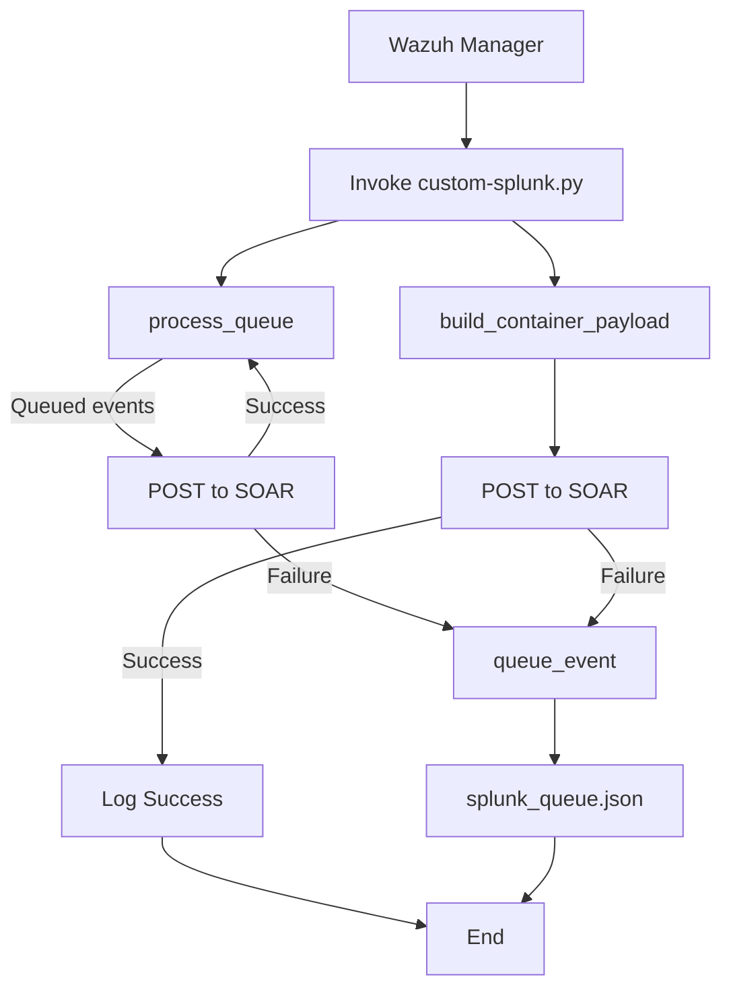

# Splunk SOAR Integration with Wazuh

This integration forwards Wazuh alerts into Splunk SOAR (Privileged On‑Prem) via a Python hook script with built‑in queueing for reliable delivery.

> **Note:** Depending on your event volume, you may experience delays as events are queued and retried on failure.

---

## 🔧 Prerequisites

* Wazuh Manager (v4.x+)
* Python 3.8+ on Wazuh Manager
* `urllib3` Python library installed
* Network connectivity from Wazuh Manager to Splunk SOAR (HTTPS)

## ⚙️ Configuration

In your `ossec.conf`, add a `<integration>` block under `<integration>…</integration>`:

```xml
<integration>
  <name>custom-splunk</name>
  <hook_url>https://<SOAR-HOST>:443/rest/container</hook_url>
  <api_key>Splunk:YOUR_PH_AUTH_TOKEN</api_key>
  <alert_format>json</alert_format>
</integration>
```

* **`hook_url`**: Splunk SOAR REST API endpoint (`/rest/container`), without trailing slash.
* **`api_key`**: Your SOAR Automation user token, prefixed with `Splunk:`.

---

## 🚀 Installation

1. Copy the script to your Wazuh integrations folder:

   ```bash
   cp custom-splunk.py /var/ossec/integrations/
   chown root:wazuh /var/ossec/integrations/custom-splunk.py
   chmod 750 /var/ossec/integrations/custom-splunk.py
   ```
2. Restart Wazuh Manager:

   ```bash
   systemctl restart wazuh-manager
   ```

---

## 📜 Workflow



---

## 🔄 Queue & Retry Logic

* **`splunk_queue.json`** stores failed containers (one JSON per line).
* On each run, the script calls `process_queue()` to retry deliveries.
* On success, queued entries are removed; failures are re‑queued.

---

## 📋 Logging

* Logs written to `/var/log/custom-splunk/custom-splunk.log`.
* INFO level by default; use `--debug` flag or set `DEBUG=True` in script for DEBUG logs.

---

## 🐞 Troubleshooting

* **No queue file?** Ensure network block test: block SOAR IP on port 443 and watch queue grow.
* **Authentication errors:** Verify `api_key` prefix and allowed IP in SOAR user settings.
* **Certificate warnings:** Script ignores SSL by default; for production use, adjust `cert_reqs` and provide valid CA.

